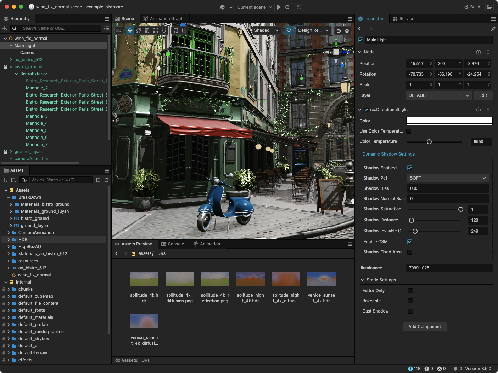

<p align="center">
    <a href="https://www.cocos.com/">
        
    </a>
</p>
<p align="center">
    <a href="https://github.com/cocos/cocos-engine/stargazers">
        
    </a>
    <a href="https://github.com/cocos-creator/engine/network">
        
    </a>
    <a href="./licenses/LICENSE">
        
    </a>
    <a href="https://twitter.com/CocosEngine">
        
    </a>
</p>

# Engine for Cocos Creator

**Cocos Creator is the new generation of game development tool in Cocos family, it brings a complete set of 3D and 2D features while providing an intuitive, low cost and collaboration friendly workflow to game developers.** Cocos Engine is the runtime framework for Cocos Creator editor.



Cocos Creator inherited many good qualities and cool features from its previous versions, such as high performance low level C++ implementation, intuitive editor, cross-platform support. It supports native platforms, web platforms and rapidly expanding instant gaming platforms, including Windows, Mac, iOS, Android, HarmonyOS, Web, Facebook Instant Games, WeChat Mini Game and TikTok Mini Games.

Furthermore, Cocos Creator has pushed the engine technology to a whole new level for high performance with scalability on various platforms, full extensibility and easy development.

1. **Modern Graphics**: The GFX implementation is designed to adapt to the modern graphics APIs, it uses Vulkan on Windows and Android, Metal on Mac OS and iOS, WebGL on Web platform.
2. **High Performance**: The runtime engine is built with half C++ and half TypeScript, low level infrastructure, native platform adaptation, renderer and scene management are all written in C++ to ensure high runtime performance. We continue to move heavy lifting work to native as much as possible.
3. **Customizable Render Pipeline**: The render pipeline is designed to be fully customizable, it has supported the builtin forward and deferred render pipeline across all platforms. Developers can customize their own render pipeline following the same approach.
4. **Extensible Surface Shader**: The material system is built on Cocos effect format which uses GLSL 300, the shader programs will be converted to suitable runtime format automatically. The surface shader permit to fully customize the surface material while ensuring universal lighting model.
5. **Physically Based Rendering (PBR)**: The standard effect adopts physically based rendering, along with the physically based camera and the lighting based on physical metrics, developers can easily achieve realistic and seamless rendering results across different environment.
6. **Easy TypeScript API**: The user level API set is provided in TypeScript, along with the powerful VSCode editor, development with Cocos Creator is incredibly efficient.

Besides all these highlights, Cocos Creator also provides builtin animation system, physics system, particle system, terrain editing support, complex UI system, instant preview etc.


This open source repository is the runtime engine of Cocos Creator, the engine is naturally integrated within Cocos Creator, designed to only be the essential runtime library and not to be used independently.

## Development and Contribution Notice

Cocos Creator engine is open source and welcomes community participation, for open source engine development with Cocos Creator editor, you should fork this repository and setup [custom engine](https://docs.cocos.com/creator/manual/en/advanced-topics/engine-customization.html) in the editor.

### Prerequisite

- Install [node.js v9.11.2 +](https://nodejs.org/)
- Install [gulp-cli v2.3.0 +](https://github.com/gulpjs/gulp/tree/master/docs/getting-started)

### Clone

Clone this repository into your local environment.

### Install

In the cloned engine folder, run the following command to setup development environment:

```bash
# download & build engine dependencies
npm install
```

This is all you have to do to setup engine development environment.

### Build

- If running inside Cocos Creator, the engine will automatically compile and build after the editor window is opened. For more instructions on modifying the engine in Cocos Creator, please refer to [Engine Customization Workflow](https://docs.cocos.com/creator/manual/en/advanced-topics/engine-customization.html).
- Outside the editor, you need to run the following command to build:

```bash
npm run build
```

Please refer to [native readme](native/README.md) if you want to develop native applications.

### Contribution

You can contribute to the Cocos Creator open source engine in many ways, they are very much appreciated:

1. Report bug or feature requests by [creating an issue](https://github.com/cocos/cocos-engine/issues/new/choose).
2. Participate discussions in the [issues](https://github.com/cocos/cocos-engine/issues/).
3. Create a pull request if you have fixed or improved anything, implemented any features.
4. Improve the documentations with pull request to the [usage documentation repository](https://github.com/cocos/cocos-docs).
5. Help other developers in our [Forum](https://discuss.cocos2d-x.org/c/creator).

### Contribution notice

If you are trying to make a pull request, there are some requirements that must be met so that your pull request can be accepted:

1. Follow our [Cpp Coding Style Guide](./docs/CPP_CODING_STYLE.md) and [TypeScript Coding Style Reference](./docs/TS_CODING_STYLE.md).
2. Try to integrate ESLint and [CPP auto fix tools](./docs/CPP_LINTER_AUTOFIX_GUIDE.md) in your coding environment.
3. Link related issues or discussions in your pull request and clearly state the purpose of your pull request.
4. Pass all automatic continuous integration tests.
5. Request file owner or engine developers to review your pull request.
6. Get one valid approval from the engine architects.

## Example Project

- [Mind Your Step 3D](https://github.com/cocos/cocos-tutorial-mind-your-step): Beginner's step-by-step tutorial project repo.
- [Test Cases](https://github.com/cocos/cocos-test-projects): Unit test scenes for every engine module.
- [Example Cases](https://github.com/cocos/cocos-example-projects): Simple yet expressive demo scenes for baseline testing and topic-specific case study.
- [Awesome Cocos](https://github.com/cocos/awesome-cocos): You can find out other useful tools and show cases here.

## Links

- [Official site](https://www.cocos.com/)
- [Download](https://www.cocos.com/en/creator/download)
- [Documentation](https://docs.cocos.com/creator/manual/en/)
- [API References](https://docs.cocos.com/creator/api/en/)
- [Projects and road map](https://github.com/orgs/cocos/projects?query=is%3Aopen&type=new)
- [Forum](https://discuss.cocos2d-x.org/c/creator)
- Discord community: Search for Cocos in the Discover panel of Discord.
