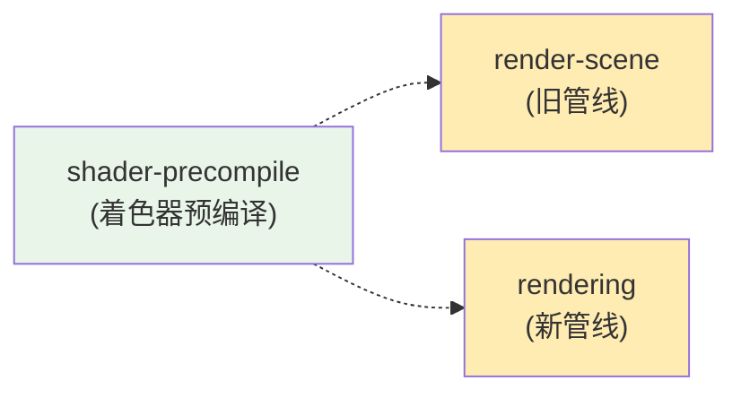
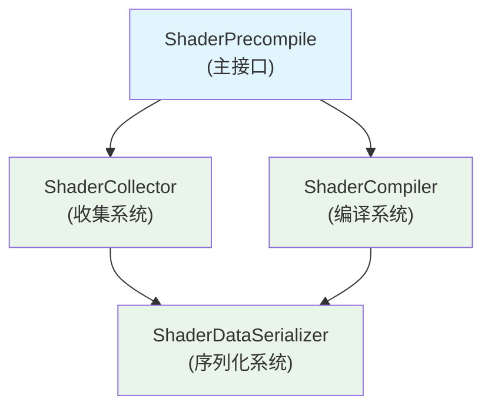

# 着色器预编译模块

## 概述

着色器预编译模块是一个性能优化系统，用于收集运行时着色器编译信息并预编译着色器，以减少游戏运行时动态着色器编译造成的掉帧问题。

## 模块依赖



**依赖说明:**
- **render-scene** - 提供旧版渲染管线的程序库和宏定义工具
- **rendering** - 提供新版渲染管线的程序库和编译接口
- **反向依赖** - 无其他模块依赖本模块

## 架构



## 组件

### 1. ShaderPrecompile（主接口）

着色器预编译功能的主要入口点。

**主要方法:**
- `startCollect()` - 开始收集着色器编译信息
- `export(options?)` - 导出收集的数据  
- `import(content, compress?)` - 导入着色器数据
- `compileAll()` - 编译所有导入的着色器
- `precompile(content, compress?)` - 一步完成导入和编译
- `getShadersCount()` - 获取已编译着色器数量

### 2. ShaderCollector（收集系统）

负责在运行时收集着色器编译信息。

**实现:**
- `OldShaderCollector` - 用于旧版渲染管线
- `NewShaderCollector` - 用于支持阶段的新版渲染管线

### 3. ShaderCompiler（编译系统）

处理从收集数据进行着色器预编译。

### 4. 序列化系统

处理带可选压缩的数据导出/导入。

**格式:**
- Raw JSON - 人类可读，较大文件
- Gzip JSON - 压缩，较小文件（TODO：压缩未实现）

## 使用方法

### 收集阶段

```typescript
import { shaderPrecompile } from 'cc';

// 开始收集着色器编译信息
shaderPrecompile.startCollect();

// ... 运行你的游戏/应用 ...
// 着色器会在渲染过程中自动收集

// 导出收集的数据
const shaderData = shaderPrecompile.export({
    compress: false,      // 是否压缩数据
    containTime: true,    // 包含时间戳信息
    containKey: true      // 包含着色器键
});

// 保存数据到文件或发送到服务器
```

### 预编译阶段

```typescript
import { shaderPrecompile } from 'cc';

// 方法1：分别导入和编译
shaderPrecompile.import(shaderData);
shaderPrecompile.compileAll();

// 方法2：一步完成导入和编译
shaderPrecompile.precompile(shaderData);

// 检查编译结果
console.log(`已编译 ${shaderPrecompile.getShadersCount()} 个着色器`);
```

## 数据格式

### 着色器编译信息

```typescript
interface IShaderCompileInfo {
    name: string;           // 着色器名称
    defines: MacroRecord;   // 宏定义
    key?: string;          // 唯一标识符
    timestamp?: number;    // 收集时间戳
}

// 仅用于新渲染管线
interface INewShaderCompileInfo extends IShaderCompileInfo {
    phaseID: number;       // 渲染阶段ID
}
```

### 导出选项

```typescript
interface ShaderCollectExportOptions {
    compress?: boolean;    // 启用压缩
    containTime?: boolean; // 包含时间戳
    containKey?: boolean;  // 包含着色器键
}
```

## 最佳实践
- 开发时在浏览器预览版本中运行收集
- 覆盖所有可能的游戏场景
- 最后导出收集文件
- 不同图形后端都可以兼容该收集文件 
- 新/旧管线收集的预编译文件不能互通, 需要分别收集

## 未来改进

- [ ] 新管线 native 还未实现
- [ ] Gzip压缩尚未实现
- [ ] 加载新effect template 以后要扫一下预编译任务列表还未实现
- [ ] 平台特定宏列表有脱节风险?
- [ ] 添加性能分析工具
- [ ] editor 还未设计和实现
