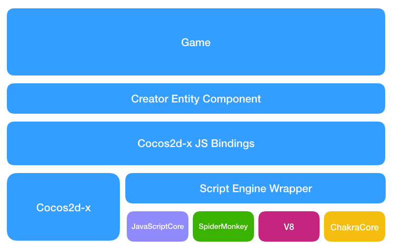
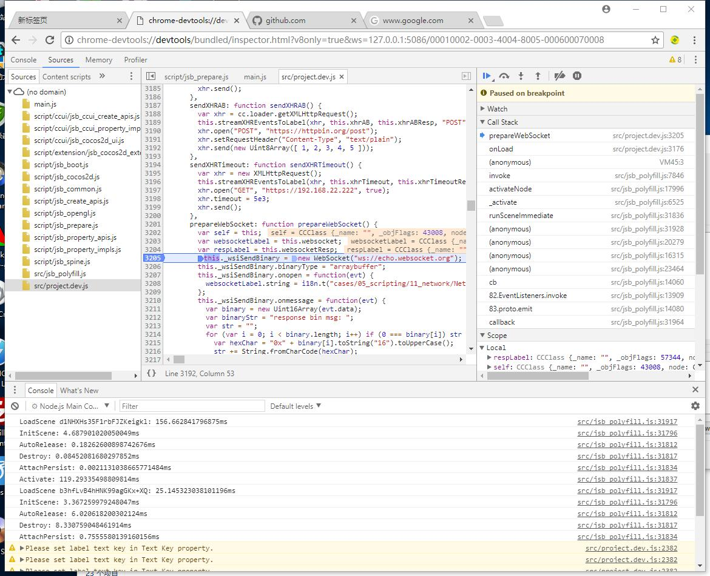
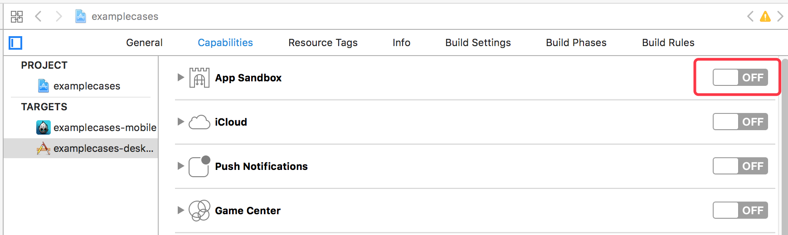
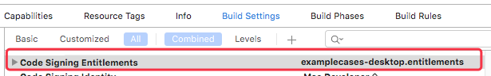
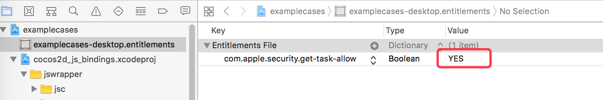
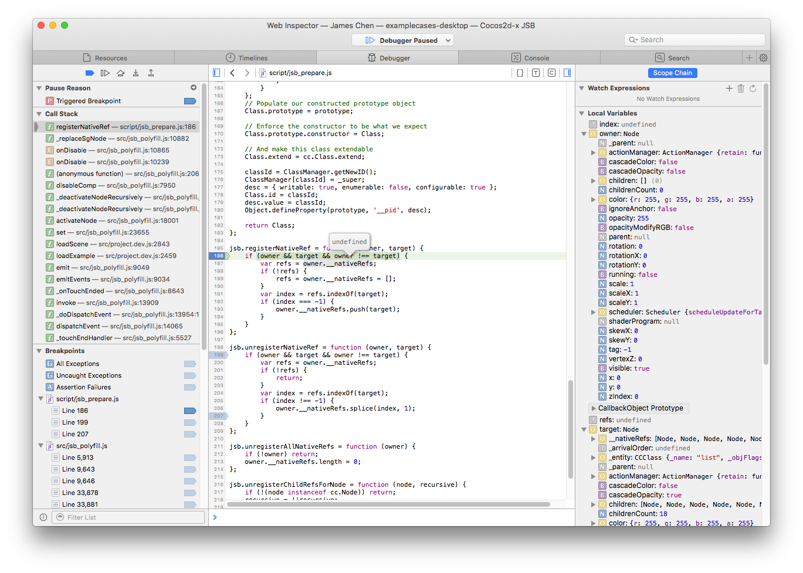
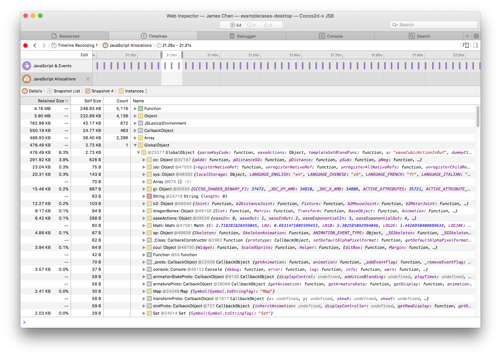

# The Tutorial for JSB 2.0

## The Abstraction Layer of Script Engine

### Architecture



### Macro

The abstraction layer is bound to take more CPU execution time than using the JS engine API directly. How to minimize the overhead of the abstraction layer becomes the first goal of the design.

Most of work in JS binding is actually setting JS related operations with CPP callbacks and associating CPP object within the callback function. In fact, it mainly contains the following two situation:

* Register JS functions (including global functions, class constructors, class destructors, class member functions, and class static member functions), binding revevant CPP callbacks

* Register accessors for JS properties, bind CPP callbacks for reading and writing properties respectively

How to achieve the minimum overhead for the abstract layer and expose the unified API?

For example, to register a JS function in CPP, there are different definitions in JavaScriptCore, SpiderMonkey, V8, ChakraCore as follows:

**JavaScriptCore:**

```c++
JSValueRef JSB_foo_func(
		JSContextRef _cx,
		JSObjectRef _function,
		JSObjectRef _thisObject,
		size_t argc,
		const JSValueRef _argv[],
		JSValueRef* _exception
	);
```

**SpiderMonkey:**

```c++
bool JSB_foo_func(
		JSContext* _cx,
		unsigned argc,
		JS::Value* _vp
	);
```

**V8:**

```c++
void JSB_foo_func(
		const v8::FunctionCallbackInfo<v8::Value>& v8args
	);
```

**ChakraCore:**

```c++
JsValueRef JSB_foo_func(
		JsValueRef _callee,
		bool _isConstructCall,
		JsValueRef* _argv,
		unsigned short argc,
		void* _callbackState
	);
```

We evaluated several options and eventually decided to use `macros` to reduce the differences between the definition and parameter types of different JS engine callbacks, regardless of which engine is used, and developers could use an unified callback definition. We refer to the definition of Lua callback function. The definition of all JS to CPP callback functions in the abstract layer is defined as:

```c++
bool foo(se::State& s)
{
	...
	...
}
SE_BIND_FUNC(foo) // Binding a JS function as an example
```

After a developer has bound a JS function, remember to wrap the callback function with the macros which start with `SE_BIND_`. Currently, we provide the following macros:

* SE\_BIND\_PROP_GET: Wrap a JS object property read callback function
* SE\_BIND\_PROP_SET: Wrap a JS object property written callback function
* SE\_BIND\_FUNC: Wrap a JS function that can be used for global functions, class member functions or class static functions
* SE\_DECLARE\_FUNC: Declare a JS function, generally used in the header file
* SE\_BIND\_CTOR: Wrap a JS constructor
* SE\_BIND\_SUB\_CLS\_CTOR: Wrap the constructor of a JS subclass by using cc.Class.extend.
* SE\_FINALIZE\_FUNC: Wrap the finalize function of a JS object, finalize function is invoked when the object is released by Garbage Collector
* SE\_DECLARE\_FINALIZE\_FUNC: Declares the finalize function of a JS object
* _SE: The macro for making callback be recognized by different JS engine. Note that the first character is underscored, similar to `_T ('xxx')` in Windows for wrapping Unicode or MultiBytes string

## API

### CPP Namespace

All types of the abstraction layer are under the `se` namespace, which is an abbreviation of `ScriptEngine`.

### Types

#### se::ScriptEngine

`se::ScriptEngine` is the JS engine administrator, responsible for JS engine initialization, destruction, restart, native module registration, loading scripts, doing garbage collection, JS exception cleanup and whether to enable the debugger.
It is a singleton that could be accessed via `se::ScriptEngine::getInstance()`.

#### se::Value

`se::Value` can be understood as a JS variable reference in the CPP layer. There are six types of JS variables: `object`,` number`, `string`,` boolean`, `null`,` undefined`, so `se::Value` uses an `union` to include ` object`, `number`,` string `,` boolean` these 4 kinds of `value types`, `non-value types` like `null` and `undefined` can be represented by `_type` directly.

```c++
namespace se {
	class Value {
		enum class Type : char
		{
		    Undefined = 0,
		    Null,
		    Number,
		    Boolean,
		    String,
		    Object
		};
		...
		...
	private:
		union {
		    bool _boolean;
		    double _number;
		    std::string* _string;
		    Object* _object;
		} _u;
		
		Type _type;
		...
		...
	};
}
```

If a `se::Value` stores the underlying data types, such as `number`,` string`, `boolean`, which is directly stored by `value copy`.
The storage of `object` is special because it is a `weak reference` to JS objects via `se::Object*`.

#### se::Object

`se::Object` extends from `se::RefCounter` which is a class for reference count management. Currently, only `se::Object` inherits from `se::RefCounter` in the abstraction layer.
As we mentioned in the last section, `se::Object` is a weak reference to the JS object, therefore I will explain why it's a weak reference.

* Reason 1: The requirement of controlling the life cycle of CPP objects by JS objects

After creating a Sprite in the script layer via `var sp = new cc.Sprite("a.png");`, we create a `se::Object` in the constructor callback and leave it in a global map (NativePtrToObjectMap), this map is used to query the `cc::Sprite*` to get the corresponding JS object `se::Object*`.

```c++
static bool js_cocos2d_Sprite_finalize(se::State& s)
{
    CC_LOG_DEBUG("jsbindings: finalizing JS object %p (cc::Sprite)", s.nativeThisObject());
    cc::Sprite* cobj = (cc::Sprite*)s.nativeThisObject();
    if (cobj->getReferenceCount() == 1)
        cobj->autorelease();
    else
        cobj->release();
    return true;
}
SE_BIND_FINALIZE_FUNC(js_cocos2d_Sprite_finalize)

static bool js_cocos2dx_Sprite_constructor(se::State& s)
{
    cc::Sprite* cobj = new (std::nothrow) cc::Sprite(); // cobj will be released in the finalize callback
    s.thisObject()->setPrivateData(cobj); // setPrivateData will make a mapping between se::Object* and cobj
    return true;
}
SE_BIND_CTOR(js_cocos2dx_Sprite_constructor, __jsb_cocos2d_Sprite_class, js_cocos2d_Sprite_finalize)
```

Imagine if you force `se::Object` to be a strong reference to a JS object that leaves JS objects out of GC control and the finalize callback will never be fired because `se::Object` is always present in map which will cause memory leak.

It is precisely because the `se::Object` holds a weak reference to a JS object so that controlling the life of the CPP object by JS object can be achieved. In the above code, when the JS object is released, it will trigger the finalize callback, developers only need to release the corresponding CPP object in `js_cocos2d_Sprite_finalize`, the release of `se::Object` has been included in the` SE_BIND_FINALIZE_FUNC` macro by automatic processing, developers do not have to manage the release of `se::Object` in `JS Object Control CPP Object` mode, but in` CPP Object Control JS Object` mode, developers have the responsibility to manage the release of `se::Object`. I will give an example in the next section.

* Reason 2：More flexible, supporting strong reference by calling the se::Object::root method manually

`se::Object` provides `root/unroot` method for developers to invoke, `root` will put JS object into the area not be scanned by the GC. After calling `root`, `se::Object*` is a strong reference to the JS object. JS object will be put back to the area scanned by the GC only when `se::Object` is destructed or `unroot` is called to make root count to zero.

Under normal circumstances, if CPP object is not a subclass of `cocos2d :: Ref`, CPP object will be used to control the life cycle of the JS object in binding. Binding the engine modules, like spine, dragonbones, box2d, anysdk and other third-party libraries uses this method. When the CPP object is released, you need to find the corresponding `se::Object` in the `NativePtrToObjectMap`, then manually `unroot` and `decRef` it. Take the binding of `spTrackEntry` in spine as an example:

```c++
spTrackEntry_setDisposeCallback([](spTrackEntry* entry){
        se::Object* seObj = nullptr;

        auto iter = se::NativePtrToObjectMap::find(entry);
        if (iter != se::NativePtrToObjectMap::end())
        {
            // Save se::Object pointer for being used in cleanup method.
            seObj = iter->second;
            // Unmap native and js object since native object was destroyed.
            // Otherwise, it may trigger 'assertion' in se::Object::setPrivateData later
            // since native obj is already released and the new native object may be assigned with
            // the same address.
            se::NativePtrToObjectMap::erase(iter);
        }
        else
        {
            return;
        }

        auto cleanup = [seObj](){

            auto se = se::ScriptEngine::getInstance();
            if (!se->isValid() || se->isInCleanup())
                return;

            se::AutoHandleScope hs;
            se->clearException();

            // The mapping of native object & se::Object was cleared in above code.
            // The private data (native object) may be a different object associated with other se::Object. 
            // Therefore, don't clear the mapping again.
            seObj->clearPrivateData(false);
            seObj->unroot();
            seObj->decRef();
        };

        if (!se::ScriptEngine::getInstance()->isGarbageCollecting())
        {
            cleanup();
        }
        else
        {
            CleanupTask::pushTaskToAutoReleasePool(cleanup);
        }
    });
```


__se::Object Types__

* Native Binding Object

	The creation of native binding object has been hidden in the `SE_BIND_CTOR` and` SE_BIND_SUB_CLS_CTOR` macros, if developers need to use the `se::Object` in the binding callback, just get it by invoking `s.thisObject()`. Where `s` is `se::State&` which will be described in the following chapters.

In addition, `se::Object` currently supports the manual creation of the following objects:

* Plain Object: Created by `se::Object::createPlainObject`, similar to `var a = {};` in JS
* Array Object: Created by `se::Object::createArrayObject`, similar to `var a = [];` in JS
* Uint8 Typed Array Object: Created by `se::Object::createTypedArray`, like `var a = new Uint8Array(buffer);` in JS
* Array Buffer Object: Created by `se::Object::createArrayBufferObject` similar to `var a = new ArrayBuffer(len);` in JS

__The Release of The Objects Created Manually__

`se::Object::createXXX` is unlike the create method in cocos2d-x, the abstraction layer is a completely separate module which does not rely on the autorelease mechanism in cocos2d-x. Although `se::Object` also inherits the reference count class `se::RefCounter`, developers need to handle the release for **objects created manually**.

```c++
se::Object* obj = se::Object::createPlainObject();
...
...
obj->decRef(); // Decrease the reference count to avoid memory leak
```

#### se::HandleObject

`se::HandleObject` is the recommended helper class for managing the objects created manually.
 
* If using manual creation of objects in complex logic, developers often forget to deal with `decRef` in different conditions

```c++
bool foo()
{
	se::Object* obj = se::Object::createPlainObject();
	if (var1)
		return false; // Return directly, forget to do 'decRef' operation
	
	if (var2)
		return false; // Return directly, forget to do 'decRef' operation
	...
	...
	obj->decRef();
	return true;
}
```

Plus adding `decRef` to different return condition branches can result in logically complex and difficult to maintain, and it is easy to forget about `decRef` if you make another return branch later.

* If the JS engine did a GC operationJS engine right after `se::Object::createXXX`, which will result in the `se::Object` reference to an illegal pointer, the program may crash.

In order to solve the above problems, the abstraction layer defines a type that assists in the management of **manually created objects**, namely `se::HandleObject`.

`se::HandleObject` is a helper class for easier management of the `release (decRef)`, `root`, and `unroot` operations of manually created `se::Object` objects.
The following two code snippets are equivalent, the use of `se::HandleObject` significantly smaller amount of code, and more secure.

```c++
    {
        se::HandleObject obj(se::Object::createPlainObject());
        obj->setProperty(...);
        otherObject->setProperty("foo", se::Value(obj));
    }
 
	is equal to：

    {
        se::Object* obj = se::Object::createPlainObject();
        obj->root(); // Root the object immediatelly to prevent the object being garabge collected.

        obj->setProperty(...);
        otherObject->setProperty("foo", se::Value(obj));
        
        obj->unroot(); // Call unroot while the object is needed anymore.
        obj->decRef(); // Decrease the reference count to avoid memory leak.
    }
```

**NOTE**

* Do not try to use `se::HandleObject` to create a native binding object. In the `JS controls of CPP` mode, the release of the bound object will be automatically handled by the abstraction layer. In the `CPP controls JS` mode, the previous chapter has already described.

* The `se::HandleObject` object can only be allocated on the stack, and a `se::Object` pointer must be passed in.


#### se::Class

`se::Class` is used to expose CPP classes to JS, it creates a constructor function in JS that has a corresponding name.

It has the following methods:

* `static se::Class* create(className, obj, parentProto, ctor)`

	**Creating a Class**. If the registration is successful, we could create an object by `var xxx = new SomeClass ();` in the JS layer.

* `bool defineFunction(name, func)`: Define a member function for a class.
* `bool defineProperty(name, getter, setter)`: Define a property accessor for a class.
* `bool defineStaticFunction(name, func)`: Define a static function for a class, the JS function could be accessed by `SomeClass.foo()` rather than the method of `var obj = new SomeClass(); obj.foo()`, means it' s a class method instead of an instance method.
* `bool defineStaticProperty(name, getter, setter)`: Define a static property accessor which could be invoked by `SomeClass.propertyA`，it's nothing about instance object.
* `bool defineFinalizeFunction(func)`: Define the finalize callback function after JS object is garbage collected.
* `bool install()`: Install a class JS engine.
* `Object* getProto()`: Get the prototype of JS constructor installed, similar to `function Foo(){}` `Foo.prototype` in JS.
* `const char* getName() const`: Get the class name which is also the name of JS constructor.

**NOTE**

You do not need to release memory manually after `se::Class` type is created, it will be automatically encapsulated layer.

You could look through the API documentation or code comments for more specific API instructions.

#### se::AutoHandleScope

The `se::AutoHandleScope` object type is purely a concept introduced to address V8 compatibility issues.
In V8, any action that calls `v8::Local<>` on a CPP function that needs to trigger a JS related operation, such as calling a JS function, accessing a JS property, etc, requires a `v8::HandleScope` function be invoked before calling these operations, otherwise it will cause the program to crash.

So the concept of `se::AutoHandleScope` was introduced into the abstraction layer, which is implemented only on V8, and the other JS engines are currently just empty implementations.

Developers need to remember that in any code execution from CPP, you need to declare a `se::AutoHandleScope` before calling JS's logic. For example:

```c++
class SomeClass {
	void update(float dt) {
		se::ScriptEngine::getInstance()->clearException(); // Clear JS exceptions
		se::AutoHandleScope hs; // Declare a handle scope, it's needed for V8
		
		se::Object* obj = ...;
		obj->setProperty(...);
		...
		...
		obj->call(...);
	}
};
```

#### se::State

In the previous section, we have mentioned the `se::State` type, which is an environment in the binding callback. We can get the current CPP pointer, `se::Object` object pointer, parameter list and return value reference through `se::State` argument.

```c++
bool foo(se::State& s)
{
	// Get native object pointer bound with the current JS object.
	SomeClass* cobj = (SomeClass*)s.nativeThisObject();
	// Get se::Object pointer that represents the current JS object.
	se::Object* thisObject = s.thisObject();
	// Get argument list of the current function.
	const se::ValueArray& args = s.args();
	// Set return value for current function.
	s.rval().setInt32(100);
	// Return true to indicate the function is executed successfully.
	return true;
}
SE_BIND_FUNC(foo)
```

## Does The Abstraction Layer Depend on Cocos2D-X?

No.

This abstraction layer was originally designed as a stand-alone module which is completely independent of Cocos2D-X engine. Developers can copy the abstraction layer code in `cocos/scripting/js-bindings/jswrapper` directory and paste them to other projects directly.

## Manual Binding

### Define A Callback Function

```c++
static bool Foo_balabala(se::State& s)
{
	const auto& args = s.args();
	int argc = (int)args.size();
	
	if (argc >= 2) // Limit the number of parameters must be greater than or equal to 2, or throw an error to the JS layer and return false.	{
		...
		...
		return true;
	}
	
	SE_REPORT_ERROR("wrong number of arguments: %d, was expecting %d", argc, 2);
	return false;
}

// If binding a function, we use SE_BIND_FUNC macro. For binding a constructor, destructor, subclass constructor, please use SE_BIND_balabala macros memtioned above.
SE_BIND_FUNC(Foo_balabala)
```

### Set A Property Value for JS object

```c++
se::Object* globalObj = se::ScriptEngine::getInstance()->getGlobalObject(); // We get the global object just for easiler demenstration.
globalObj->setProperty("foo", se::Value(100)); // Set a property called `foo` with a value of 100 to the global object.
```

Then, you can use the `foo` global variable in JS directly.

```js
cc.log("foo value: " + foo); // Print `foo value: 100`.
```

### Set A Property Accessor for JS Object

```c++
// The read callback of `foo` property of the global object
static bool Global_get_foo(se::State& s)
{
	NativeObj* cobj = (NativeObj*)s.nativeThisObject();
	int32_t ret = cobj->getValue();
	s.rval().setInt32(ret);
	return true;
}
SE_BIND_PROP_GET(Global_get_foo)

// The write callback of `foo` property of the global object
static bool Global_set_foo(se::State& s)
{
	const auto& args = s.args();
	int argc = (int)args.size();
	if (argc >= 1)
	{
		NativeObj* cobj = (NativeObj*)s.nativeThisObject();
		int32_t arg1 = args[0].toInt32();
		cobj->setValue(arg1);
		// Do not need to call `s.rval().set(se::Value::Undefined)` for functions without return value.
		return true;
	}

	SE_REPORT_ERROR("wrong number of arguments: %d, was expecting %d", argc, 1);
	return false;
}
SE_BIND_PROP_SET(Global_set_foo)

void some_func()
{
	se::Object* globalObj = se::ScriptEngine::getInstance()->getGlobalObject(); // We get the global object just for easiler demenstration.
	globalObj->defineProperty("foo", _SE(Global_get_foo), _SE(Global_set_foo)); // Use _SE macro to package specific function name.
}
```

### Define A Function for JS Object

```c++
static bool Foo_function(se::State& s)
{
	...
	...
}
SE_BIND_FUNC(Foo_function)

void some_func()
{
	se::Object* globalObj = se::ScriptEngine::getInstance()->getGlobalObject(); // We get the global object just for easiler demenstration.
	globalObj->defineFunction("foo", _SE(Foo_function)); // Use _SE macro to package specific function name.
}

```

### Register A CPP Class to JS Virtual Machine

```c++
static se::Object* __jsb_ns_SomeClass_proto = nullptr;
static se::Class* __jsb_ns_SomeClass_class = nullptr;

namespace ns {
    class SomeClass
    {
    public:
        SomeClass()
        : xxx(0)
        {}

        void foo() {
            printf("SomeClass::foo\n");
            
            Application::getInstance()->getScheduler()->schedule([this](float dt){
                static int counter = 0;
                ++counter;
                if (_cb != nullptr)
                    _cb(counter);
            }, this, 1.0f, CC_REPEAT_FOREVER, 0.0f, false, "iamkey");
        }

        static void static_func() {
            printf("SomeClass::static_func\n");
        }

        void setCallback(const std::function<void(int)>& cb) {
            _cb = cb;
            if (_cb != nullptr)
            {
                printf("setCallback(cb)\n");
            }
            else
            {
                printf("setCallback(nullptr)\n");
            }
        }

        int xxx;
    private:
        std::function<void(int)> _cb;
    };
} // namespace ns {

static bool js_SomeClass_finalize(se::State& s)
{
    ns::SomeClass* cobj = (ns::SomeClass*)s.nativeThisObject();
    delete cobj;
    return true;
}
SE_BIND_FINALIZE_FUNC(js_SomeClass_finalize)

static bool js_SomeClass_constructor(se::State& s)
{
    ns::SomeClass* cobj = new ns::SomeClass();
    s.thisObject()->setPrivateData(cobj);
    return true;
}
SE_BIND_CTOR(js_SomeClass_constructor, __jsb_ns_SomeClass_class, js_SomeClass_finalize)

static bool js_SomeClass_foo(se::State& s)
{
    ns::SomeClass* cobj = (ns::SomeClass*)s.nativeThisObject();
    cobj->foo();
    return true;
}
SE_BIND_FUNC(js_SomeClass_foo)

static bool js_SomeClass_get_xxx(se::State& s)
{
    ns::SomeClass* cobj = (ns::SomeClass*)s.nativeThisObject();
    s.rval().setInt32(cobj->xxx);
    return true;
}
SE_BIND_PROP_GET(js_SomeClass_get_xxx)

static bool js_SomeClass_set_xxx(se::State& s)
{
    const auto& args = s.args();
    int argc = (int)args.size();
    if (argc > 0)
    {
        ns::SomeClass* cobj = (ns::SomeClass*)s.nativeThisObject();
        cobj->xxx = args[0].toInt32();
        return true;
    }

    SE_REPORT_ERROR("wrong number of arguments: %d, was expecting %d", argc, 1);
    return false;
}
SE_BIND_PROP_SET(js_SomeClass_set_xxx)

static bool js_SomeClass_static_func(se::State& s)
{
    ns::SomeClass::static_func();
    return true;
}
SE_BIND_FUNC(js_SomeClass_static_func)

bool js_register_ns_SomeClass(se::Object* global)
{
    // Make sure the namespace exists
    se::Value nsVal;
    if (!global->getProperty("ns", &nsVal))
    {
        // If it doesn't exist, create one. Similar as `var ns = {};` in JS.
        se::HandleObject jsobj(se::Object::createPlainObject());
        nsVal.setObject(jsobj);

        // Set the object to the global object with the property name `ns`.
        global->setProperty("ns", nsVal);
    }
    se::Object* ns = nsVal.toObject();

    // Create a se::Class object, developers do not need to consider the release of the se::Class object, which is automatically handled by the ScriptEngine.
    auto cls = se::Class::create("SomeClass", ns, nullptr, _SE(js_SomeClass_constructor)); // If the registered class doesn't need a  constructor, the last argument can be passed in with nullptr, it will make  `new SomeClass();` illegal.

    // Define member functions, member properties.
    cls->defineFunction("foo", _SE(js_SomeClass_foo));
    cls->defineProperty("xxx", _SE(js_SomeClass_get_xxx), _SE(js_SomeClass_set_xxx));

	// Define finalize callback function
    cls->defineFinalizeFunction(_SE(js_SomeClass_finalize));

    // Install the class to JS virtual machine
    cls->install();

    // JSBClassType::registerClass is a helper function in the Cocos2D-X native binding code, which is not a part of the ScriptEngine.
    JSBClassType::registerClass<ns::SomeClass>(cls);

    // Save the result to global variable for easily use in other places, for example class inheritence.
    __jsb_ns_SomeClass_proto = cls->getProto();
    __jsb_ns_SomeClass_class = cls;

    // Set a property `yyy` with the string value `helloyyy` for each object instantiated by this class.
    __jsb_ns_SomeClass_proto->setProperty("yyy", se::Value("helloyyy"));

    // Register static member variables and static member functions
    se::Value ctorVal;
    if (ns->getProperty("SomeClass", &ctorVal) && ctorVal.isObject())
    {
        ctorVal.toObject()->setProperty("static_val", se::Value(200));
        ctorVal.toObject()->defineFunction("static_func", _SE(js_SomeClass_static_func));
    }

    // Clear JS exceptions
    se::ScriptEngine::getInstance()->clearException();
    return true;
}
```

### How to Bind A CPP Callback Function

```c++
static bool js_SomeClass_setCallback(se::State& s)
{
    const auto& args = s.args();
    int argc = (int)args.size();
    if (argc >= 1)
    {
        ns::SomeClass* cobj = (ns::SomeClass*)s.nativeThisObject();

        se::Value jsFunc = args[0];
        se::Value jsTarget = argc > 1 ? args[1] : se::Value::Undefined;

        if (jsFunc.isNullOrUndefined())
        {
            cobj->setCallback(nullptr);
        }
        else
        {
            assert(jsFunc.isObject() && jsFunc.toObject()->isFunction());

            // If the current SomeClass is a class that can be created by `new`, we use se::Object::attachObject to associate jsFunc with jsTarget to the current object.
            s.thisObject()->attachObject(jsFunc.toObject());
            s.thisObject()->attachObject(jsTarget.toObject());

            // If the current SomeClass class is a singleton, or a class that always has only one instance, we can not associate it with se::Object::attachObject.
            // Instead, you must use se::Object::root, developers do not need to unroot since unroot operation will be triggered in the destruction of lambda which makes the se::Value jsFunc be destroyed, then se::Object destructor will do the unroot operation automatically.
            // The binding function `js_cocos2dx_EventDispatcher_addCustomEventListener` implements it in this way because `EventDispatcher` is always a singleton.
            // Using s.thisObject->attachObject(jsFunc.toObject); for binding addCustomEventListener will cause jsFunc and jsTarget varibales can't be released, which will result in memory leak.

            // jsFunc.toObject()->root();
            // jsTarget.toObject()->root();

            cobj->setCallback([jsFunc, jsTarget](int counter){

                // Add the following two lines of code in CPP callback function before passing data to the JS.
                se::ScriptEngine::getInstance()->clearException();
                se::AutoHandleScope hs;
                //

                se::ValueArray args;
                args.push_back(se::Value(counter));

                se::Object* target = jsTarget.isObject() ? jsTarget.toObject() : nullptr;
                jsFunc.toObject()->call(args, target);
            });
        }

        return true;
    }

    SE_REPORT_ERROR("wrong number of arguments: %d, was expecting %d", argc, 1);
    return false;
}
SE_BIND_FUNC(js_SomeClass_setCallback)
```

After SomeClass is registered, you can use it in JS like the following:

```js
 var myObj = new ns.SomeClass();
 myObj.foo();
 ns.SomeClass.static_func();
 cc.log("ns.SomeClass.static_val: " + ns.SomeClass.static_val);
 cc.log("Old myObj.xxx:" + myObj.xxx);
 myObj.xxx = 1234;
 cc.log("New myObj.xxx:" + myObj.xxx);
 cc.log("myObj.yyy: " + myObj.yyy);

 var delegateObj = {
     onCallback: function(counter) {
         cc.log("Delegate obj, onCallback: " + counter + ", this.myVar: " + this.myVar);
         this.setVar();
     },

     setVar: function() {
         this.myVar++;
     },

     myVar: 100
 };

 myObj.setCallback(delegateObj.onCallback, delegateObj);

 setTimeout(function(){
    myObj.setCallback(null);
 }, 6000); // Clear callback after 6 seconds.
```

There will be some logs outputed in console:

```
SomeClass::foo
SomeClass::static_func
ns.SomeClass.static_val: 200
Old myObj.xxx:0
New myObj.xxx:1234
myObj.yyy: helloyyy
setCallback(cb)
Delegate obj, onCallback: 1, this.myVar: 100
Delegate obj, onCallback: 2, this.myVar: 101
Delegate obj, onCallback: 3, this.myVar: 102
Delegate obj, onCallback: 4, this.myVar: 103
Delegate obj, onCallback: 5, this.myVar: 104
Delegate obj, onCallback: 6, this.myVar: 105
setCallback(nullptr)
```

### How to Use The Helper Functions in Cocos2D-X Binding for Easiler Native<->JS Type Conversions 

The helper functions for native<->JS type conversions are located in `cocos/scripting/js-bindings/manual/jsb_conversions.h/.cpp`, it includes:

#### Convert se::Value to CPP Type

```
bool seval_to_int32(const se::Value& v, int32_t* ret);
bool seval_to_uint32(const se::Value& v, uint32_t* ret);
bool seval_to_int8(const se::Value& v, int8_t* ret);
bool seval_to_uint8(const se::Value& v, uint8_t* ret);
bool seval_to_int16(const se::Value& v, int16_t* ret);
bool seval_to_uint16(const se::Value& v, uint16_t* ret);
bool seval_to_boolean(const se::Value& v, bool* ret);
bool seval_to_float(const se::Value& v, float* ret);
bool seval_to_double(const se::Value& v, double* ret);
bool seval_to_long(const se::Value& v, long* ret);
bool seval_to_ulong(const se::Value& v, unsigned long* ret);
bool seval_to_longlong(const se::Value& v, long long* ret);
bool seval_to_ssize(const se::Value& v, ssize_t* ret);
bool seval_to_std_string(const se::Value& v, std::string* ret);
bool seval_to_Vec2(const se::Value& v, cc::Vec2* pt);
bool seval_to_Vec3(const se::Value& v, cc::Vec3* pt);
bool seval_to_Vec4(const se::Value& v, cc::Vec4* pt);
bool seval_to_Mat4(const se::Value& v, cc::Mat4* mat);
bool seval_to_Size(const se::Value& v, cc::Size* size);
bool seval_to_Rect(const se::Value& v, cc::Rect* rect);
bool seval_to_Color3B(const se::Value& v, cc::Color3B* color);
bool seval_to_Color4B(const se::Value& v, cc::Color4B* color);
bool seval_to_Color4F(const se::Value& v, cc::Color4F* color);
bool seval_to_ccvalue(const se::Value& v, cc::Value* ret);
bool seval_to_ccvaluemap(const se::Value& v, cc::ValueMap* ret);
bool seval_to_ccvaluemapintkey(const se::Value& v, cc::ValueMapIntKey* ret);
bool seval_to_ccvaluevector(const se::Value& v, cc::ValueVector* ret);
bool sevals_variadic_to_ccvaluevector(const se::ValueArray& args, cc::ValueVector* ret);
bool seval_to_blendfunc(const se::Value& v, cc::BlendFunc* ret);
bool seval_to_std_vector_string(const se::Value& v, std::vector<std::string>* ret);
bool seval_to_std_vector_int(const se::Value& v, std::vector<int>* ret);
bool seval_to_std_vector_float(const se::Value& v, std::vector<float>* ret);
bool seval_to_std_vector_Vec2(const se::Value& v, std::vector<cc::Vec2>* ret);
bool seval_to_std_vector_Touch(const se::Value& v, std::vector<cc::Touch*>* ret);
bool seval_to_std_map_string_string(const se::Value& v, std::map<std::string, std::string>* ret);
bool seval_to_FontDefinition(const se::Value& v, cc::FontDefinition* ret);
bool seval_to_Acceleration(const se::Value& v, cc::Acceleration* ret);
bool seval_to_Quaternion(const se::Value& v, cc::Quaternion* ret);
bool seval_to_AffineTransform(const se::Value& v, cc::AffineTransform* ret);
//bool seval_to_Viewport(const se::Value& v, cc::experimental::Viewport* ret);
bool seval_to_Data(const se::Value& v, cc::Data* ret);
bool seval_to_DownloaderHints(const se::Value& v, cc::network::DownloaderHints* ret);
bool seval_to_TTFConfig(const se::Value& v, cc::TTFConfig* ret);

//box2d seval to native convertion
bool seval_to_b2Vec2(const se::Value& v, b2Vec2* ret);
bool seval_to_b2AABB(const se::Value& v, b2AABB* ret);

template<typename T>
bool seval_to_native_ptr(const se::Value& v, T* ret);

template<typename T>
bool seval_to_Vector(const se::Value& v, cc::Vector<T>* ret);

template<typename T>
bool seval_to_Map_string_key(const se::Value& v, cc::Map<std::string, T>* ret)

```

#### Convert C++ Type to se::Value

```c++
bool int8_to_seval(int8_t v, se::Value* ret);
bool uint8_to_seval(uint8_t v, se::Value* ret);
bool int32_to_seval(int32_t v, se::Value* ret);
bool uint32_to_seval(uint32_t v, se::Value* ret);
bool int16_to_seval(uint16_t v, se::Value* ret);
bool uint16_to_seval(uint16_t v, se::Value* ret);
bool boolean_to_seval(bool v, se::Value* ret);
bool float_to_seval(float v, se::Value* ret);
bool double_to_seval(double v, se::Value* ret);
bool long_to_seval(long v, se::Value* ret);
bool ulong_to_seval(unsigned long v, se::Value* ret);
bool longlong_to_seval(long long v, se::Value* ret);
bool ssize_to_seval(ssize_t v, se::Value* ret);
bool std_string_to_seval(const std::string& v, se::Value* ret);

bool Vec2_to_seval(const cc::Vec2& v, se::Value* ret);
bool Vec3_to_seval(const cc::Vec3& v, se::Value* ret);
bool Vec4_to_seval(const cc::Vec4& v, se::Value* ret);
bool Mat4_to_seval(const cc::Mat4& v, se::Value* ret);
bool Size_to_seval(const cc::Size& v, se::Value* ret);
bool Rect_to_seval(const cc::Rect& v, se::Value* ret);
bool Color3B_to_seval(const cc::Color3B& v, se::Value* ret);
bool Color4B_to_seval(const cc::Color4B& v, se::Value* ret);
bool Color4F_to_seval(const cc::Color4F& v, se::Value* ret);
bool ccvalue_to_seval(const cc::Value& v, se::Value* ret);
bool ccvaluemap_to_seval(const cc::ValueMap& v, se::Value* ret);
bool ccvaluemapintkey_to_seval(const cc::ValueMapIntKey& v, se::Value* ret);
bool ccvaluevector_to_seval(const cc::ValueVector& v, se::Value* ret);
bool blendfunc_to_seval(const cc::BlendFunc& v, se::Value* ret);
bool std_vector_string_to_seval(const std::vector<std::string>& v, se::Value* ret);
bool std_vector_int_to_seval(const std::vector<int>& v, se::Value* ret);
bool std_vector_float_to_seval(const std::vector<float>& v, se::Value* ret);
bool std_vector_Touch_to_seval(const std::vector<cc::Touch*>& v, se::Value* ret);
bool std_map_string_string_to_seval(const std::map<std::string, std::string>& v, se::Value* ret);
bool uniform_to_seval(const cc::Uniform* v, se::Value* ret);
bool FontDefinition_to_seval(const cc::FontDefinition& v, se::Value* ret);
bool Acceleration_to_seval(const cc::Acceleration* v, se::Value* ret);
bool Quaternion_to_seval(const cc::Quaternion& v, se::Value* ret);
bool ManifestAsset_to_seval(const cc::extension::ManifestAsset& v, se::Value* ret);
bool AffineTransform_to_seval(const cc::AffineTransform& v, se::Value* ret);
bool Data_to_seval(const cc::Data& v, se::Value* ret);
bool DownloadTask_to_seval(const cc::network::DownloadTask& v, se::Value* ret);

template<typename T>
bool Vector_to_seval(const cc::Vector<T*>& v, se::Value* ret);

template<typename T>
bool Map_string_key_to_seval(const cc::Map<std::string, T*>& v, se::Value* ret);

template<typename T>
bool native_ptr_to_seval(typename std::enable_if<!std::is_base_of<cc::Ref,T>::value,T>::type* v, se::Value* ret, bool* isReturnCachedValue = nullptr);

template<typename T>
bool native_ptr_to_seval(typename std::enable_if<!std::is_base_of<cc::Ref,T>::value,T>::type* v, se::Class* cls, se::Value* ret, bool* isReturnCachedValue = nullptr)

template<typename T>
bool native_ptr_to_seval(typename std::enable_if<std::is_base_of<cc::Ref,T>::value,T>::type* v, se::Value* ret, bool* isReturnCachedValue = nullptr);

template<typename T>
bool native_ptr_to_seval(typename std::enable_if<std::is_base_of<cc::Ref,T>::value,T>::type* v, se::Class* cls, se::Value* ret, bool* isReturnCachedValue = nullptr);

template<typename T>
bool native_ptr_to_rooted_seval(typename std::enable_if<!std::is_base_of<cc::Ref,T>::value,T>::type* v, se::Value* ret, bool* isReturnCachedValue = nullptr);

template<typename T>
bool native_ptr_to_rooted_seval(typename std::enable_if<!std::is_base_of<cc::Ref,T>::value,T>::type* v, se::Class* cls, se::Value* ret, bool* isReturnCachedValue = nullptr);


// Spine conversions
bool speventdata_to_seval(const spEventData& v, se::Value* ret);
bool spevent_to_seval(const spEvent& v, se::Value* ret);
bool spbonedata_to_seval(const spBoneData& v, se::Value* ret);
bool spbone_to_seval(const spBone& v, se::Value* ret);
bool spskeleton_to_seval(const spSkeleton& v, se::Value* ret);
bool spattachment_to_seval(const spAttachment& v, se::Value* ret);
bool spslotdata_to_seval(const spSlotData& v, se::Value* ret);
bool spslot_to_seval(const spSlot& v, se::Value* ret);
bool sptimeline_to_seval(const spTimeline& v, se::Value* ret);
bool spanimationstate_to_seval(const spAnimationState& v, se::Value* ret);
bool spanimation_to_seval(const spAnimation& v, se::Value* ret);
bool sptrackentry_to_seval(const spTrackEntry& v, se::Value* ret);

// Box2d
bool b2Vec2_to_seval(const b2Vec2& v, se::Value* ret);
bool b2Manifold_to_seval(const b2Manifold* v, se::Value* ret);
bool b2AABB_to_seval(const b2AABB& v, se::Value* ret);

```

Auxiliary conversion functions are not part of the abstraction layer (`Script Engine Wrapper`), they belong to the Cocos2D-X binding layer and are encapsulated to facilitate more convenient conversion in the binding code.
Each conversion function returns the type `bool` indicating whether the conversion was successful or not. Developers need to check the return value after calling these interfaces.

You can know the specific usage directly according to interface names. The first parameter in the interface is input, and the second parameter is the output parameter. The usage is as follows:

```c++
se::Value v;
bool ok = int32_to_seval(100, &v); // The second parameter is the output parameter, passing in the address of the output parameter
```

```c++
int32_t v;
bool ok = seval_to_int32(args[0], &v); // The second parameter is the output parameter, passing in the address of the output parameter
```

#### (IMPORTANT) Understand The Difference Between native\_ptr\_to\_seval and native\_ptr\_to\_rooted\_seval

**Developers must understand the difference to make sure these conversion functions not being misused. In that case, JS memory leaks, which is really difficult to fix, could be avoided.**

* `native_ptr_to_seval` is used in `JS control CPP object life cycle` mode. This method can be called when a `se::Value` needs to be obtained from a CPP object pointer at the binding code. Most subclasses in the Cocos2D-X that inherit from `cc::Ref` take this approach to get `se::Value`. Please remember, when the binding object, which is controlled by the JS object's life cycle, need to be converted to seval, use this method, otherwise consider using `native_ptr_to_rooted_seval`.
* `native_ptr_to_rooted_seval` is used in `CPP controlling JS object lifecycle` mode. In general, this method is used for object bindings in third-party libraries. This method will try to find the cached `se::Object` according the incoming CPP object pointer, if the cached `se::Object`is not exist, then it will create a rooted `se::Object` which isn't controlled by Garbage Collector and will always keep alive until `unroot` is called. Developers need to observe the release of the CPP object, and `unroot` `se::Object`. Please refer to the section introduces `spTrackEntry` binding (spTrackEntry_setDisposeCallback) described above.


## Automatic Binding

### Configure Module .ini Files

The configuration method is the same as that in Creator v1.6. The main points to note are: In Creator v1.7 `script_control_cpp` field is deprecated because `script_control_cpp` field affects the entire module. If the module needs to bind the `cc::Ref` subclass and non- `cc::Ref` class, the original binding configuration in v1.6 can not meet the demand. The new field introduced in v1.7 is `classes_owned_by_cpp`, which indicates which classes need to be controlled by the CPP object's life cycle.

An additional, there is a configuration field in v1.7 is `persistent_classes` to indicate which classes are always present during game play, such as: `TextureCache`, `SpriteFrameCache`, `FileUtils`, `EventDispatcher`, `ActionManager`, `Scheduler`.

Other fields are the same as v1.6.

For more specific, please refer to the engine directory `tools/tojs/cocos2dx.ini` file.

### Understand The Meaning of Each Field in The .ini file

```
# Module name
[cocos2d-x] 

# The prefix for callback functions and the binding file name.
prefix = engine

# The namspace of the binding class attaches to.
target_namespace = jsb

# Automatic binding tools is based on the Android NDK. The android_headers field configures the search path of Android header file.
android_headers =

# Configure building parameters for Android.
android_flags = -target armv7-none-linux-androideabi -D_LIBCPP_DISABLE_VISIBILITY_ANNOTATIONS -DANDROID -D__ANDROID_API__=14 -gcc-toolchain %(gcc_toolchain_dir)s --sysroot=%(androidndkdir)s/platforms/android-14/arch-arm  -idirafter %(androidndkdir)s/sources/android/support/include -idirafter %(androidndkdir)s/sysroot/usr/include -idirafter %(androidndkdir)s/sysroot/usr/include/arm-linux-androideabi -idirafter %(clangllvmdir)s/lib64/clang/5.0/include -I%(androidndkdir)s/sources/

# Configure the search path for clang header file.
clang_headers =

# Configure building parameters for clang
clang_flags = -nostdinc -x c++ -std=c++11 -fsigned-char -U__SSE__

# Configure the search path for Cocos2D-X header file
cocos_headers = -I%(cocosdir)s/cocos -I%(cocosdir)s/cocos/platform/android -I%(cocosdir)s/external/sources

# Configure building parameters for Cocos2D-X
cocos_flags = -DANDROID -DCC_PLATFORM=3 -DCC_PLATFORM_IOS=1 -DCC_PLATFORM_MACOS=4 -DCC_PLATFORM_WINDOWS=2 -DCC_PLATFORM_ANDROID=3


# Configure extra building parameters
extra_arguments = %(android_headers)s %(clang_headers)s %(cxxgenerator_headers)s %(cocos_headers)s %(android_flags)s %(clang_flags)s %(cocos_flags)s %(extra_flags)s
 
# Which header files needed to be parsed
headers = %(cocosdir)s/cocos/cocos2d.h

# Rename the header file in the generated binding code
replace_headers=

# Which classes need to be bound, you can use regular expressions, separated by space.
classes = FileUtils$ SAXParser CanvasRenderingContext2D CanvasGradient Device

# Which classes which use cc.Class.extend to inherit, separated by space.
classes_need_extend = 

# Which classes need to bind properties, separated by commas
field =

# Which classes need to be skipped, separated by commas
skip = FileUtils::[getFileData setFilenameLookupDictionary destroyInstance getFullPathCache getContents],
        SAXParser::[(?!(init))],
        Device::[getDeviceMotionValue],
        CanvasRenderingContext2D::[setCanvasBufferUpdatedCallback set_.+]

# Which functions need to be renamed, separated by commas
rename_functions = FileUtils::[loadFilenameLookupDictionaryFromFile=loadFilenameLookup],
                   CanvasRenderingContext2D::[getImageData=_getImageData]

# Which classes need to be renamed, separated by commas
rename_classes = SAXParser::PlistParser

# Which classes do not have parents in JS
classes_have_no_parents = SAXParser

# Which C++ base classes need to be skipped
base_classes_to_skip = Ref Clonable

# Which classes are abstract classes which do not have a constructor in JS
abstract_classes = SAXParser Device

# Which classes are singleton or always keep alive until game exits
persistent_classes = FileUtils

# Which classes use `CPP object controls JS object's life cycle`, the unconfigured classes will use `JS controls CPP object's life cycle`.
classes_owned_by_cpp = 
```

## Remote Debugging and Profile

The remote debugging and profile are valid in debug mode, if you need to enable in release mode, you need to manually modify the macro in `cocos/scripting/js-bindings/jswrapper/config.h`.

```c++
#if defined(CC_DEBUG) && CC_DEBUG > 0
#define SE_ENABLE_INSPECTOR 1
#define SE_DEBUG 2
#else
#define SE_ENABLE_INSPECTOR 0
#define SE_DEBUG 0
#endif
```

Change to：

```c++
#if 1 // Change to 1 to force enable remote debugging
#define SE_ENABLE_INSPECTOR 1
#define SE_DEBUG 2
#else
#define SE_ENABLE_INSPECTOR 0
#define SE_DEBUG 0
#endif
```

### Remote Debugging V8 in Chrome

#### Windows

* Compile, run the game (or run directly in the Creator simulator)
* Open with Chrome: [devtools://devtools/bundled/js_app.html?v8only=true&ws=127.0.0.1:6086/00010002-0003-4004-8005-000600070008](devtools://devtools/bundled/js_app.html?v8only=true&ws=127.0.0.1:6086/00010002-0003-4004-8005-000600070008)

Breakpoint debugging：


Catch JS Heap


Profile


#### Android

* Make sure your Android device is on the same network as your PC or Mac
* Compile and run your game
* Open with Chrome: [devtools://devtools/bundled/js_app.html?v8only=true&ws=xxx.xxx.xxx.xxx:6086/00010002-0003-4004-8005-000600070008](devtools://devtools/bundled/js_app.html?v8only=true&ws=xxx.xxx.xxx.xxx:6086/00010002-0003-4004-8005-000600070008), `xxx.xxx.xxx.xxx` is the IP address of Android device
* The remote debugging interface is the same as debugging Windows.


### Remote Debugging JavaScriptCore in Safari

#### macOS

1. Open Safari on your Mac, Preferences -> Advanced -> Show Develop menu in menu bar
2. Add entitlements file to Xcode project, skip this step if entitlements exist. If it does not exist, open the App Sandbox in the Capabilities setting of the project, and then close again. At this point, the .entitlements file is automatically added to the project.. You also need to make sure the entitlements file is included in the Code Signing Entitlemenets option in the Build Setting. 
3. Open the entitlements file, add com.apple.security.get-task-allow, the value type is Boolean, the value is YES. 
4. Signature: General -> Choose your Mac Project -> Signing -> Choose your Developer Certificate
5. Compile and run your game
6. If it is run directly in Creator's simulator, you can skip steps 2,3,4,5
7. Click Safari menu, select Develop -> your Mac device name -> Cocos2d-x JSB will automatically open the Web Inspector page, and then you can set breakpoints, Timeline profile, console and other operations.  

**NOTE**

If developers have to modify the engine source or merge some patches, they need to recompile the simulator, remember to reset the simulator project certificate.


Then run `gulp gen-simulator` in terminal to generate simulator.

#### iOS

1. Open the iPhone Settings -> Safari -> Advanced -> Web Inspector
2. Add entitlements file to Xcode project, skip this step if entitlements exist. If it does not exist, open the App Sandbox in the Capabilities setting of the project, and then close again. At this point, the .entitlements file is automatically added to the project. You also need to make sure the entitlements file is included in the Code Signing Entitlemenets option in the Build Setting. (The illustration image is similar to step 2 of macOS)
3. Open the entitlements file, add com.apple.security.get-task-allow, the value type is Boolean, the value is YES. (The illustration image is similar to step 3 of macOS)
4. Signature: General -> Choose your iOS project -> Signing -> Choose your developer certificate
5. Compile and run your game
6. Click Safari menu, select Develop -> your iOS device name -> Cocos2d-x JSB will automatically open the Web Inspector page, and then you can set breakpoints, Timeline profile, console and other operations.(The illustration image is similar to step 7 of macOS)

## Q & A

### What's The Difference between se::Object::root/unroot and se::Object::incRef/decRef?

`root`/`unroot` is used to control whether JS objects are controlled by GC, `root` means JS object should not be controlled by GC, `unroot` means it should be controlled by GC. For a `se::Object`, `root` and `unroot` can be called multiple times, `se::Object`'s internal `_rootCount` variables is used to indicate the count of `root` operation. When `unroot` is called and `_rootCount` reach **0**, the JS object associated with `se::Object` is handed over to the GC. Another situation is that if `se::Object` destructor is triggered and `_rootCount` is still greater than 0, it will force the JS object to be controlled by the GC.

`incRef`/`decRef` is used to control the life cycle of `se::Object` CPP object. As mentioned in the previous section, it is recommended that you use `se::HandleObject` to control the manual creation of unbound objects's  life cycle. So, in general, developers do not need to touch `incRef`/`decRef`.


### The Association and Disassociation of Object's Life Cycle

Use se::Object::attachObject to associate object's life cycle.
Use se::Object::dettachObject to disassociate object's life cycle.

`objA->attachObject(objB);` is similar as `objA .__ nativeRefs [index] = objB` in JS. Only when `objA` is garbage collected, `objB` will be possible garbage collected.
`objA->dettachObject(objB);` is similar as `delete objA.__nativeRefs[index];` in JS. After invoking dettachObject, objB's life cycle will not be controlled by objA

### What's The Difference of Object Life Management between The Subclass of `cc::Ref` and non-`cc::Ref` class?

The binding of `cc::Ref` subclass in the current engine adopts JS object controls the life cycle of CPP object. The advantage of doing so is to solve the `retain`/`release` problem that has been criticized in the JS layer.

Non-`cc::Ref` class takes the way of CPP object controls the life of a JS object. This method requires that after CPP object is destroyed, it needs to notify the binding layer to call the `clearPrivateData`, `unroot`, and `decRef` methods corresponding to `se::Object`. JS code must be careful operation of the object, when there may be illegal object logic, use `cc.sys.isObjectValid` to determine whether the CPP object is released.

### NOTE of Binding The Finalize Function for cc::Ref Subclass

Calling any JS engine's API in a finalize callback can lead to a crash. Because the current engine is in garbage collection process, which can not be interrupted to deal with other operations.
Finalize callback is to tell the CPP layer to release the memory of the corresponding CPP object, we should not call any JS engine API in the CPP object's destructor either.

#### But if that must be called, how should we deal with?

In Cocos2D-X binding, if the native object's reference count is 1, we do not use the `release`, but using `autorelease` to delay CPP object's destructor to be executed at the end of frame. For instance:

```c++
static bool js_cocos2d_Sprite_finalize(se::State& s)
{
    CC_LOG_DEBUG("jsbindings: finalizing JS object %p (cc::Sprite)", s.nativeThisObject());
    cc::Sprite* cobj = (cc::Sprite*)s.nativeThisObject();
    if (cobj->getReferenceCount() == 1)
        cobj->autorelease();
    else
        cobj->release();
    return true;
}
SE_BIND_FINALIZE_FUNC(js_cocos2d_Sprite_finalize)
```

### Please DO NOT Assign A Subclass of cc::Ref on The Stack

Subclasses of `cc::Ref` must be allocated on the heap, via `new`, and then released by` release`. In JS object's finalize callback function, we should use 'autorelease` or `release` to release. If it is allocated on the stack, the reference count is likely to be 0, and then calling `release` in finalize callback will result `delete` is invoked, which causing the program to crash. So in order to prevent this behavior from happening, developers can identify destructors as `protected` or` private` in the binding classes that inherit from `cc::Ref`, ensuring that this problem can be found during compilation.

E.g:

```c++
class CC_EX_DLL EventAssetsManagerEx : public cc::EventCustom
{
public:
    ...
    ...
private:
    virtual ~EventAssetsManagerEx() {}
    ...
    ...
};

EventAssetsManagerEx event(...); // Compilation ERROR
dispatcher->dispatchEvent(&event);

// Must modify to:

EventAssetsManagerEx* event = new EventAssetsManagerEx(...);
dispatcher->dispatchEvent(event);
event->release();
```


### How to Observe JS Exception?

In AppDelegate.cpp, using `se::ScriptEngine::getInstance()->setExceptionCallback(...)` to set the callback of JS exception.

```c++
bool AppDelegate::applicationDidFinishLaunching()
{
    ...
    ...
    se::ScriptEngine* se = se::ScriptEngine::getInstance();

    se->setExceptionCallback([](const char* location, const char* message, const char* stack){
        // Send exception information to server like Tencent Bugly.
        // ...
        // ...
    });

    jsb_register_all_modules();
    ...
    ...
    return true;
}

```


