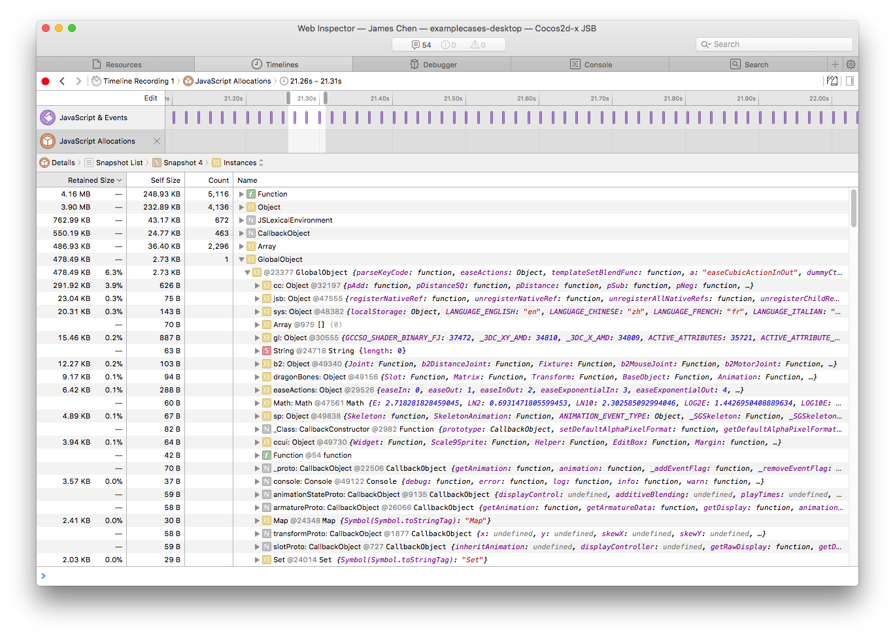

# JSB 2.0 绑定教程

## 抽象层

### 架构


### 宏（Macro）

抽象层必然会比直接使用 JS 引擎 API 的方式多占用一些 CPU 执行时间，如何把抽象层本身的开销降到最低成为设计的第一目标。

JS 绑定的大部分工作其实就是设定 JS 相关操作的 CPP 回调，在回调函数中关联 CPP 对象。其实主要包含如下两种类型：

* 注册 JS 函数（包含全局函数，类构造函数、类析构函数、类成员函数，类静态成员函数），绑定一个 CPP 回调
* 注册 JS 对象的属性读写访问器，分别绑定读与写的 CPP 回调

如何做到抽象层开销最小而且暴露统一的 API 供上层使用？

以注册 JS 函数的回调定义为例，JavaScriptCore，SpiderMonkey，V8，ChakraCore 的定义各不相同，具体如下：

**JavaScriptCore:**

```c++
JSValueRef JSB_foo_func(
		JSContextRef _cx,
		JSObjectRef _function,
		JSObjectRef _thisObject,
		size_t argc,
		const JSValueRef _argv[],
		JSValueRef* _exception
	);
```

**SpiderMonkey:**

```c++
bool JSB_foo_func(
		JSContext* _cx,
		unsigned argc,
		JS::Value* _vp
	);
```

**V8:**

```c++
void JSB_foo_func(
		const v8::FunctionCallbackInfo<v8::Value>& v8args
	);
```

**ChakraCore:**

```c++
JsValueRef JSB_foo_func(
		JsValueRef _callee,
		bool _isConstructCall,
		JsValueRef* _argv,
		unsigned short argc,
		void* _callbackState
	);
```

我们评估了几种方案，最终确定使用`宏`来抹平不同 JS 引擎回调函数定义与参数类型的不同，不管底层是使用什么引擎，开发者统一使用一种回调函数的定义。我们借鉴了 lua 的回调函数定义方式，抽象层所有的 JS 到 CPP 的回调函数的定义为：

```c++
bool foo(se::State& s)
{
	...
	...
}
SE_BIND_FUNC(foo) // 此处以回调函数的定义为例
```

开发者编写完回调函数后，记住使用 `SE_BIND_XXX` 系列的宏对回调函数进行包装。目前提供了如下几个宏：

* SE\_BIND\_PROP_GET：包装一个 JS 对象属性读取的回调函数
* SE\_BIND\_PROP_SET：包装一个 JS 对象属性写入的回调函数
* SE\_BIND_FUNC：包装一个 JS 函数，可用于全局函数、类成员函数、类静态函数
* SE\_DECLARE_FUNC：声明一个 JS 函数，一般在 .h 头文件中使用
* SE\_BIND_CTOR：包装一个 JS 构造函数
* SE\_BIND\_SUB\_CLS\_CTOR：包装一个 JS 子类的构造函数，此子类使用 cc.Class.extend 继承 Native 绑定类
* SE\_FINALIZE_FUNC：包装一个 JS 对象被 GC 回收后的回调函数
* SE\_DECLARE\_FINALIZE_FUNC：声明一个 JS 对象被 GC 回收后的回调函数
* _SE：包装回调函数的名称，转义为每个 JS 引擎能够识别的回调函数的定义，注意，第一个字符为下划线，类似 Windows 下用的`_T("xxx")`来包装 Unicode 或者 MultiBytes 字符串

## API

### CPP 命名空间（namespace）

CPP 抽象层所有的类型都在 `se` 命名空间下，其为 ScriptEngine 的缩写。

### 类型

#### se::ScriptEngine

se::ScriptEngine 为 JS 引擎的管理员，掌管 JS 引擎初始化、销毁、重启、Native 模块注册、加载脚本、强制垃圾回收、JS 异常清理、是否启用调试器。
它是一个单例，可通过 se::ScriptEngine::getInstance() 得到对应的实例。

#### se::Value

se::Value 可以被理解为 JS 变量在 CPP 层的引用。JS 变量有 `object`, `number`, `string`, `boolean`, `null`, `undefined` 六种类型，因此 se::Value 使用 `union` 包含 `object`, `number`, `string`, `boolean`4 种`有值类型`，`无值类型`: `null`, `undefined` 可由 `_type` 直接表示。

```c++
namespace se {
	class Value {
		enum class Type : char
		{
		    Undefined = 0,
		    Null,
		    Number,
		    Boolean,
		    String,
		    Object
		};
		...
		...
	private:
		union {
		    bool _boolean;
		    double _number;
		    std::string* _string;
		    Object* _object;
		} _u;
		
		Type _type;
		...
		...
	};
}
```

如果 se::Value 中保存基础数据类型，比如 `number`，`string`，`boolean`，其内部是直接存储一份值副本。
`object` 的存储比较特殊，是通过 `se::Object*` 对 JS 对象的弱引用(weak reference)。

#### se::Object

se::Object 继承于 se::RefCounter 引用计数管理类。目前抽象层中只有 se::Object 继承于 se::RefCounter。
上一小节我们说到，se::Object 是保存了对 JS 对象的弱引用，这里笔者有必要解释一下为什么是弱引用。

* 原因一：JS 对象控制 CPP 对象的生命周期的需要

当在脚本层中通过 `var sp = new cc.Sprite("a.png");` 创建了一个 Sprite 后，在构造回调函数绑定中我们会创建一个 se::Object 并保留在一个全局的 map (NativePtrToObjectMap) 中，此 map 用于查询 `cocos2d::Sprite*` 指针获取对应的 JS 对象 `se::Object*` 。

```c++
static bool js_cocos2d_Sprite_finalize(se::State& s)
{
    CCLOG("jsbindings: finalizing JS object %p (cocos2d::Sprite)", s.nativeThisObject());
    cocos2d::Sprite* cobj = (cocos2d::Sprite*)s.nativeThisObject();
    if (cobj->getReferenceCount() == 1)
        cobj->autorelease();
    else
        cobj->release();
    return true;
}
SE_BIND_FINALIZE_FUNC(js_cocos2d_Sprite_finalize)

static bool js_cocos2dx_Sprite_constructor(se::State& s)
{
    cocos2d::Sprite* cobj = new (std::nothrow) cocos2d::Sprite(); // cobj 将在 finalize 函数中被释放
    s.thisObject()->setPrivateData(cobj); // setPrivateData 内部会去保存 cobj 到 NativePtrToObjectMap 中
    return true;
}
SE_BIND_CTOR(js_cocos2dx_Sprite_constructor, __jsb_cocos2d_Sprite_class, js_cocos2d_Sprite_finalize)
```

设想如果强制要求 se::Object 为 JS 对象的强引用(strong reference)，即让 JS 对象不受 GC 控制，由于 se::Object 一直存在于 map 中，finalize 回调将永远无法被触发，从而导致内存泄露。

正是由于 se::Object 保存的是 JS 对象的弱引用，JS 对象控制 CPP 对象的生命周期才能够实现。以上代码中，当 JS 对象被释放后，会触发 finalize 回调，开发者只需要在 `js_cocos2d_Sprite_finalize` 中释放对应的 c++ 对象即可，se::Object 的释放已经被包含在 `SE_BIND_FINALIZE_FUNC` 宏中自动处理，开发者无需管理在`JS 对象控制 CPP 对象`模式中 se::Object 的释放，但是在 `CPP 对象控制 JS 对象` 模式中，开发者需要管理对 se::Object 的释放，具体下一节中会举例说明。

* 原因二：更加灵活，手动调用 root 方法以支持强引用

se::Object 中提供了 root/unroot 方法供开发者调用，root 会把 JS 对象放入到不受 GC 扫描到的区域，调用 root 后，se::Object 就强引用了 JS 对象，只有当 unroot 被调用，或者 se::Object 被释放后，JS 对象才会放回到受 GC 扫描到的区域。

一般情况下，如果对象是非 `cocos2d::Ref` 的子类，会采用 CPP 对象控制 JS 对象的生命周期的方式去绑定。引擎内 spine, dragonbones, box2d，anysdk 等第三方库的绑定就是采用此方式。当 CPP 对象被释放的时候，需要在 NativePtrToObjectMap 中查找对应的 se::Object，然后手动 unroot 和 decRef。以 spine 中 spTrackEntry 的绑定为例：

```c++
spTrackEntry_setDisposeCallback([](spTrackEntry* entry){
        // spTrackEntry 的销毁回调
        se::Object* seObj = nullptr;

        auto iter = se::NativePtrToObjectMap::find(entry);
        if (iter != se::NativePtrToObjectMap::end())
        {
            // 保存 se::Object 指针，用于在下面的 cleanup 函数中释放其内存
            seObj = iter->second;
            // Native 对象 entry 的内存已经被释放，因此需要立马解除 Native 对象与 JS 对象的关联。
            // 如果解除引用关系放在下面的 cleanup 函数中处理，有可能触发 se::Object::setPrivateData 中
            // 的断言，因为新生成的 Native 对象的地址可能与当前对象相同，而 cleanup 可能被延迟到帧结束前执行。
            se::NativePtrToObjectMap::erase(iter);
        }
        else
        {
            return;
        }

        auto cleanup = [seObj](){

            auto se = se::ScriptEngine::getInstance();
            if (!se->isValid() || se->isInCleanup())
                return;

            se::AutoHandleScope hs;
            se->clearException();
            
            // 由于上面逻辑已经把映射关系解除了，这里传入 false 表示不用再次解除映射关系,
            // 因为当前 seObj 的 private data 可能已经是另外一个不同的对象
            seObj->clearPrivateData(false);
            seObj->unroot(); // unroot，使 JS 对象受 GC 管理
            seObj->decRef(); // 释放 se::Object
        };

        // 确保不再垃圾回收中去操作 JS 引擎的 API
        if (!se::ScriptEngine::getInstance()->isGarbageCollecting())
        {
            cleanup();
        }
        else
        { // 如果在垃圾回收，把清理任务放在帧结束中进行
            CleanupTask::pushTaskToAutoReleasePool(cleanup);
        }
    });
```


__对象类型__

绑定对象的创建已经被隐藏在对应的 `SE_BIND_CTOR` 和 `SE_BIND_SUB_CLS_CTOR` 函数中，开发者在绑定回调中如果需要用到当前对象对应的 se::Object，只需要通过 s.thisObject() 即可获取。其中 s 为 se::State 类型，具体会在后续章节中说明。

此外，se::Object 目前支持以下几种对象的手动创建：

* Plain Object : 通过 se::Object::createPlainObject 创建，类似 JS 中的 `var a = {};`
* Array Object : 通过 se::Object::createArrayObject 创建，类似 JS 中的 `var a = [];`
* Uint8 Typed Array Object : 通过 se::Object::createTypedArray 创建，类似 JS 中的 `var a = new Uint8Array(buffer);`
* Array Buffer Object : 通过 se::Object::createArrayBufferObject，类似 JS 中的 `var a = new ArrayBuffer(len);`

__手动创建对象的释放__

se::Object::createXXX 方法与 cocos2d-x 中的 create 方法不同，抽象层是完全独立的一个模块，并不依赖与 cocos2d-x 的 autorelease 机制。虽然 se::Object 也是继承引用计数类，但开发者需要处理**手动创建出来的对象**的释放。

```c++
se::Object* obj = se::Object::createPlainObject();
...
...
obj->decRef(); // 释放引用，避免内存泄露
```

#### se::HandleObject （推荐的管理手动创建对象的辅助类）

* 在比较复杂的逻辑中使用手动创建对象，开发者往往会忘记在不同的逻辑中处理 decRef

```c++
bool foo()
{
	se::Object* obj = se::Object::createPlainObject();
	if (var1)
		return false; // 这里直接返回了，忘记做 decRef 释放操作
	
	if (var2)
		return false; // 这里直接返回了，忘记做 decRef 释放操作
	...
	...
	obj->decRef();
	return true;
}
```

就算在不同的返回条件分支中加上了 decRef 也会导致逻辑复杂，难以维护，如果后期加入另外一个返回分支，很容易忘记 decRef。

* JS 引擎在 se::Object::createXXX 后，如果由于某种原因 JS 引擎做了 GC 操作，导致后续使用的 se::Object 内部引用了一个非法指针，引发程序崩溃

为了解决上述两个问题，抽象层定义了一个辅助管理**手动创建对象**的类型，即 `se::HandleObject` 。

`se::HandleObject` 是一个辅助类，用于更加简单地管理手动创建的 se::Object 对象的释放、root 和 unroot 操作。
以下两种代码写法是等价的，使用 se::HandleObject 的代码量明显少很多，而且更加安全。

```c++
    {
        se::HandleObject obj(se::Object::createPlainObject());
        obj->setProperty(...);
        otherObject->setProperty("foo", se::Value(obj));
    }
 
	等价于：

    {
        se::Object* obj = se::Object::createPlainObject();
        obj->root(); // 在手动创建完对象后立马 root，防止对象被 GC

        obj->setProperty(...);
        otherObject->setProperty("foo", se::Value(obj));
        
        obj->unroot(); // 当对象被使用完后，调用 unroot
        obj->decRef(); // 引用计数减一，避免内存泄露
    }
```

注意：

* 不要尝试使用 se::HandleObject 创建一个 native 与 JS 的绑定对象，在 JS 控制 CPP 的模式中，绑定对象的释放会被抽象层自动处理，在 CPP 控制 JS 的模式中，前一章节中已经有描述了。
* se::HandleObject 对象只能够在栈上被分配，而且栈上构造的时候必须传入一个 se::Object 指针。


#### se::Class

se::Class 用于暴露 CPP 类到 JS 中，它会在 JS 中创建一个对应名称的 constructor function。

它有如下方法：

* `static se::Class* create(className, obj, parentProto, ctor)`: 创建一个 Class，注册成功后，在 JS 层中可以通过`var xxx = new SomeClass();`的方式创建一个对象
* `bool defineFunction(name, func)`: 定义 Class 中的成员函数
* `bool defineProperty(name, getter, setter)`: 定义 Class 属性读写器
* `bool defineStaticFunction(name, func)`: 定义 Class 的静态成员函数，可通过 SomeClass.foo() 这种非 new 的方式访问，与类实例对象无关
* `bool defineStaticProperty(name, getter, setter)`: 定义 Class 的静态属性读写器，可通过 SomeClass.propertyA 直接读写，与类实例对象无关
* `bool defineFinalizeFunction(func)`: 定义 JS 对象被 GC 后的 CPP 回调
* `bool install()`: 注册此类到 JS 虚拟机中
* `Object* getProto()`: 获取注册到 JS 中的类（其实是 JS 的 constructor）的 prototype 对象，类似 function Foo(){}的 Foo.prototype
* `const char* getName() const`: 获取当前 Class 的名称

**注意：**

Class 类型创建后，不需要手动释放内存，它会被封装层自动处理。

更具体 API 说明可以翻看 API 文档或者代码注释

#### se::AutoHandleScope

se::AutoHandleScope 对象类型完全是为了解决 V8 的兼容问题而引入的概念。
V8 中，当有 CPP 函数中需要触发 JS 相关操作，比如调用 JS 函数，访问 JS 属性等任何调用 v8::Local<> 的操作，V8 强制要求在调用这些操作前必须存在一个 v8::HandleScope 作用域，否则会引发程序崩溃。

因此抽象层中引入了 se::AutoHandleScope 的概念，其只在 V8 上有实现，其他 JS 引擎目前都只是空实现。

开发者需要记住，在任何代码执行中，需要调用 JS 的逻辑前，声明一个 se::AutoHandleScope 即可，比如：

```c++
class SomeClass {
	void update(float dt) {
		se::ScriptEngine::getInstance()->clearException();
		se::AutoHandleScope hs;
		
		se::Object* obj = ...;
		obj->setProperty(...);
		...
		...
		obj->call(...);
	}
};
```

#### se::State

之前章节我们有提及 State 类型，它是绑定回调中的一个环境，我们通过 se::State 可以取得当前的 CPP 指针、se::Object 对象指针、参数列表、返回值引用。

```c++
bool foo(se::State& s)
{
	// 获取 native 对象指针
	SomeClass* cobj = (SomeClass*)s.nativeThisObject();
	// 获取 se::Object 对象指针
	se::Object* thisObject = s.thisObject();
	// 获取参数列表
	const se::ValueArray& args = s.args();
	// 设置返回值
	s.rval().setInt32(100);
	return true;
}
SE_BIND_FUNC(foo)
```

## 抽象层依赖 Cocos 引擎么？

不依赖。

ScriptEngine 这层设计之初就将其定义为一个独立模块，完全不依赖 Cocos 引擎。开发者完整可以通过 copy、paste 把 cocos/scripting/js-bindings/jswrapper 下的所有抽象层源码拷贝到其他项目中直接使用。

## 手动绑定

### 回调函数声明

```c++
static bool Foo_balabala(se::State& s)
{
	const auto& args = s.args();
	int argc = (int)args.size();
	
	if (argc >= 2) // 这里约定参数个数必须大于等于 2，否则抛出错误到 JS 层且返回 false
	{
		...
		...
		return true;
	}
	
	SE_REPORT_ERROR("wrong number of arguments: %d, was expecting %d", argc, 2);
	return false;
}

// 如果是绑定函数，则用 SE_BIND_FUNC，构造函数、析构函数、子类构造函数等类似
SE_BIND_FUNC(Foo_balabala)
```

### 为 JS 对象设置一个属性值

```c++
se::Object* globalObj = se::ScriptEngine::getInstance()->getGlobalObject(); // 这里为了演示方便，获取全局对象
globalObj->setProperty("foo", se::Value(100)); // 给全局对象设置一个 foo 属性，值为 100
```

在 JS 中就可以直接使用 foo 这个全局变量了

```js
cc.log("foo value: " + foo); // 打印出 foo value: 100
```

### 为 JS 对象定义一个属性读写回调

```c++
// 全局对象的 foo 属性的读回调
static bool Global_get_foo(se::State& s)
{
	NativeObj* cobj = (NativeObj*)s.nativeThisObject();
	int32_t ret = cobj->getValue();
	s.rval().setInt32(ret);
	return true;
}
SE_BIND_PROP_GET(Global_get_foo)

// 全局对象的 foo 属性的写回调
static bool Global_set_foo(se::State& s)
{
	const auto& args = s.args();
	int argc = (int)args.size();
	if (argc >= 1)
	{
		NativeObj* cobj = (NativeObj*)s.nativeThisObject();
		int32_t arg1 = args[0].toInt32();
		cobj->setValue(arg1);
		// void 类型的函数，无需设置 s.rval，未设置默认返回 undefined 给 JS 层
		return true;
	}

	SE_REPORT_ERROR("wrong number of arguments: %d, was expecting %d", argc, 1);
	return false;
}
SE_BIND_PROP_SET(Global_set_foo)

void some_func()
{
	se::Object* globalObj = se::ScriptEngine::getInstance()->getGlobalObject(); // 这里为了演示方便，获取全局对象
	globalObj->defineProperty("foo", _SE(Global_get_foo), _SE(Global_set_foo)); // 使用_SE 宏包装一下具体的函数名称
}
```

### 为 JS 对象设置一个函数

```c++
static bool Foo_function(se::State& s)
{
	...
	...
}
SE_BIND_FUNC(Foo_function)

void some_func()
{
	se::Object* globalObj = se::ScriptEngine::getInstance()->getGlobalObject(); // 这里为了演示方便，获取全局对象
	globalObj->defineFunction("foo", _SE(Foo_function)); // 使用_SE 宏包装一下具体的函数名称
}

```

### 注册一个 CPP 类到 JS 虚拟机中

```c++
static se::Object* __jsb_ns_SomeClass_proto = nullptr;
static se::Class* __jsb_ns_SomeClass_class = nullptr;

namespace ns {
    class SomeClass
    {
    public:
        SomeClass()
        : xxx(0)
        {}

        void foo() {
            printf("SomeClass::foo\n");
            
            Application::getInstance()->getScheduler()->schedule([this](float dt){
                static int counter = 0;
                ++counter;
                if (_cb != nullptr)
                    _cb(counter);
            }, this, 1.0f, CC_REPEAT_FOREVER, 0.0f, false, "iamkey");
        }

        static void static_func() {
            printf("SomeClass::static_func\n");
        }

        void setCallback(const std::function<void(int)>& cb) {
            _cb = cb;
            if (_cb != nullptr)
            {
                printf("setCallback(cb)\n");
            }
            else
            {
                printf("setCallback(nullptr)\n");
            }
        }

        int xxx;
    private:
        std::function<void(int)> _cb;
    };
} // namespace ns {

static bool js_SomeClass_finalize(se::State& s)
{
    ns::SomeClass* cobj = (ns::SomeClass*)s.nativeThisObject();
    delete cobj;
    return true;
}
SE_BIND_FINALIZE_FUNC(js_SomeClass_finalize)

static bool js_SomeClass_constructor(se::State& s)
{
    ns::SomeClass* cobj = new ns::SomeClass();
    s.thisObject()->setPrivateData(cobj);
    return true;
}
SE_BIND_CTOR(js_SomeClass_constructor, __jsb_ns_SomeClass_class, js_SomeClass_finalize)

static bool js_SomeClass_foo(se::State& s)
{
    ns::SomeClass* cobj = (ns::SomeClass*)s.nativeThisObject();
    cobj->foo();
    return true;
}
SE_BIND_FUNC(js_SomeClass_foo)

static bool js_SomeClass_get_xxx(se::State& s)
{
    ns::SomeClass* cobj = (ns::SomeClass*)s.nativeThisObject();
    s.rval().setInt32(cobj->xxx);
    return true;
}
SE_BIND_PROP_GET(js_SomeClass_get_xxx)

static bool js_SomeClass_set_xxx(se::State& s)
{
    const auto& args = s.args();
    int argc = (int)args.size();
    if (argc > 0)
    {
        ns::SomeClass* cobj = (ns::SomeClass*)s.nativeThisObject();
        cobj->xxx = args[0].toInt32();
        return true;
    }

    SE_REPORT_ERROR("wrong number of arguments: %d, was expecting %d", argc, 1);
    return false;
}
SE_BIND_PROP_SET(js_SomeClass_set_xxx)

static bool js_SomeClass_static_func(se::State& s)
{
    ns::SomeClass::static_func();
    return true;
}
SE_BIND_FUNC(js_SomeClass_static_func)

bool js_register_ns_SomeClass(se::Object* global)
{
    // 保证 namespace 对象存在
    se::Value nsVal;
    if (!global->getProperty("ns", &nsVal))
    {
        // 不存在则创建一个 JS 对象，相当于 var ns = {};
        se::HandleObject jsobj(se::Object::createPlainObject());
        nsVal.setObject(jsobj);

        // 将 ns 对象挂载到 global 对象中，名称为 ns
        global->setProperty("ns", nsVal);
    }
    se::Object* ns = nsVal.toObject();

    // 创建一个 Class 对象，开发者无需考虑 Class 对象的释放，其交由 ScriptEngine 内部自动处理
    auto cls = se::Class::create("SomeClass", ns, nullptr, _SE(js_SomeClass_constructor)); // 如果无构造函数，最后一个参数可传入 nullptr，则这个类在 JS 中无法被 new SomeClass()出来

    // 为这个 Class 对象定义成员函数、属性、静态函数、析构函数
    cls->defineFunction("foo", _SE(js_SomeClass_foo));
    cls->defineProperty("xxx", _SE(js_SomeClass_get_xxx), _SE(js_SomeClass_set_xxx));

    cls->defineFinalizeFunction(_SE(js_SomeClass_finalize));

    // 注册类型到 JS VirtualMachine 的操作
    cls->install();

    // JSBClassType 为 Cocos 引擎绑定层封装的类型注册的辅助函数，此函数不属于 ScriptEngine 这层
    JSBClassType::registerClass<ns::SomeClass>(cls);

    // 保存注册的结果，便于其他地方使用，比如类继承
    __jsb_ns_SomeClass_proto = cls->getProto();
    __jsb_ns_SomeClass_class = cls;

    // 为每个此 Class 实例化出来的对象附加一个属性
    __jsb_ns_SomeClass_proto->setProperty("yyy", se::Value("helloyyy"));

    // 注册静态成员变量和静态成员函数
    se::Value ctorVal;
    if (ns->getProperty("SomeClass", &ctorVal) && ctorVal.isObject())
    {
        ctorVal.toObject()->setProperty("static_val", se::Value(200));
        ctorVal.toObject()->defineFunction("static_func", _SE(js_SomeClass_static_func));
    }

    // 清空异常
    se::ScriptEngine::getInstance()->clearException();
    return true;
}
```

### 如何绑定 CPP 接口中的回调函数？

```c++
static bool js_SomeClass_setCallback(se::State& s)
{
    const auto& args = s.args();
    int argc = (int)args.size();
    if (argc >= 1)
    {
        ns::SomeClass* cobj = (ns::SomeClass*)s.nativeThisObject();

        se::Value jsFunc = args[0];
        se::Value jsTarget = argc > 1 ? args[1] : se::Value::Undefined;

        if (jsFunc.isNullOrUndefined())
        {
            cobj->setCallback(nullptr);
        }
        else
        {
            assert(jsFunc.isObject() && jsFunc.toObject()->isFunction());

            // 如果当前 SomeClass 是可以被 new 出来的类，我们 使用 se::Object::attachObject 把 jsFunc 和 jsTarget 关联到当前对象中
            s.thisObject()->attachObject(jsFunc.toObject());
            s.thisObject()->attachObject(jsTarget.toObject());

            // 如果当前 SomeClass 类是一个单例类，或者永远只有一个实例的类，我们不能用 se::Object::attachObject 去关联
            // 必须使用 se::Object::root，开发者无需关系 unroot，unroot 的操作会随着 lambda 的销毁触发 jsFunc 的析构，在 se::Object 的析构函数中进行 unroot 操作。
            // js_cocos2dx_EventDispatcher_addCustomEventListener 的绑定代码就是使用此方式，因为 EventDispatcher 始终只有一个实例，
            // 如果使用 s.thisObject->attachObject(jsFunc.toObject);会导致对应的 func 和 target 永远无法被释放，引发内存泄露。

            // jsFunc.toObject()->root();
            // jsTarget.toObject()->root();

            cobj->setCallback([jsFunc, jsTarget](int counter){

                // CPP 回调函数中要传递数据给 JS 或者调用 JS 函数，在回调函数开始需要添加如下两行代码。
                se::ScriptEngine::getInstance()->clearException();
                se::AutoHandleScope hs;

                se::ValueArray args;
                args.push_back(se::Value(counter));

                se::Object* target = jsTarget.isObject() ? jsTarget.toObject() : nullptr;
                jsFunc.toObject()->call(args, target);
            });
        }

        return true;
    }

    SE_REPORT_ERROR("wrong number of arguments: %d, was expecting %d", argc, 1);
    return false;
}
SE_BIND_FUNC(js_SomeClass_setCallback)
```

SomeClass 类注册后，就可以在 JS 中这样使用了：

```js
 var myObj = new ns.SomeClass();
 myObj.foo();
 ns.SomeClass.static_func();
 cc.log("ns.SomeClass.static_val: " + ns.SomeClass.static_val);
 cc.log("Old myObj.xxx:" + myObj.xxx);
 myObj.xxx = 1234;
 cc.log("New myObj.xxx:" + myObj.xxx);
 cc.log("myObj.yyy: " + myObj.yyy);

 var delegateObj = {
     onCallback: function(counter) {
         cc.log("Delegate obj, onCallback: " + counter + ", this.myVar: " + this.myVar);
         this.setVar();
     },

     setVar: function() {
         this.myVar++;
     },

     myVar: 100
 };

 myObj.setCallback(delegateObj.onCallback, delegateObj);

 setTimeout(function(){
    myObj.setCallback(null);
 }, 6000); // 6 秒后清空 callback
```

Console 中会输出：

```
SomeClass::foo
SomeClass::static_func
ns.SomeClass.static_val: 200
Old myObj.xxx:0
New myObj.xxx:1234
myObj.yyy: helloyyy
setCallback(cb)
Delegate obj, onCallback: 1, this.myVar: 100
Delegate obj, onCallback: 2, this.myVar: 101
Delegate obj, onCallback: 3, this.myVar: 102
Delegate obj, onCallback: 4, this.myVar: 103
Delegate obj, onCallback: 5, this.myVar: 104
Delegate obj, onCallback: 6, this.myVar: 105
setCallback(nullptr)
```

### 如何使用 cocos2d-x bindings 这层的类型转换辅助函数？

类型转换辅助函数位于`cocos/scripting/js-bindings/manual/jsb_conversions.hpp/.cpp`中，其包含：

#### se::Value 转换为 C++ 类型
```
bool seval_to_int32(const se::Value& v, int32_t* ret);
bool seval_to_uint32(const se::Value& v, uint32_t* ret);
bool seval_to_int8(const se::Value& v, int8_t* ret);
bool seval_to_uint8(const se::Value& v, uint8_t* ret);
bool seval_to_int16(const se::Value& v, int16_t* ret);
bool seval_to_uint16(const se::Value& v, uint16_t* ret);
bool seval_to_boolean(const se::Value& v, bool* ret);
bool seval_to_float(const se::Value& v, float* ret);
bool seval_to_double(const se::Value& v, double* ret);
bool seval_to_long(const se::Value& v, long* ret);
bool seval_to_ulong(const se::Value& v, unsigned long* ret);
bool seval_to_longlong(const se::Value& v, long long* ret);
bool seval_to_ssize(const se::Value& v, ssize_t* ret);
bool seval_to_std_string(const se::Value& v, std::string* ret);
bool seval_to_Vec2(const se::Value& v, cocos2d::Vec2* pt);
bool seval_to_Vec3(const se::Value& v, cocos2d::Vec3* pt);
bool seval_to_Vec4(const se::Value& v, cocos2d::Vec4* pt);
bool seval_to_Mat4(const se::Value& v, cocos2d::Mat4* mat);
bool seval_to_Size(const se::Value& v, cocos2d::Size* size);
bool seval_to_Rect(const se::Value& v, cocos2d::Rect* rect);
bool seval_to_Color3B(const se::Value& v, cocos2d::Color3B* color);
bool seval_to_Color4B(const se::Value& v, cocos2d::Color4B* color);
bool seval_to_Color4F(const se::Value& v, cocos2d::Color4F* color);
bool seval_to_ccvalue(const se::Value& v, cocos2d::Value* ret);
bool seval_to_ccvaluemap(const se::Value& v, cocos2d::ValueMap* ret);
bool seval_to_ccvaluemapintkey(const se::Value& v, cocos2d::ValueMapIntKey* ret);
bool seval_to_ccvaluevector(const se::Value& v, cocos2d::ValueVector* ret);
bool sevals_variadic_to_ccvaluevector(const se::ValueArray& args, cocos2d::ValueVector* ret);
bool seval_to_blendfunc(const se::Value& v, cocos2d::BlendFunc* ret);
bool seval_to_std_vector_string(const se::Value& v, std::vector<std::string>* ret);
bool seval_to_std_vector_int(const se::Value& v, std::vector<int>* ret);
bool seval_to_std_vector_float(const se::Value& v, std::vector<float>* ret);
bool seval_to_std_vector_Vec2(const se::Value& v, std::vector<cocos2d::Vec2>* ret);
bool seval_to_std_vector_Touch(const se::Value& v, std::vector<cocos2d::Touch*>* ret);
bool seval_to_std_map_string_string(const se::Value& v, std::map<std::string, std::string>* ret);
bool seval_to_FontDefinition(const se::Value& v, cocos2d::FontDefinition* ret);
bool seval_to_Acceleration(const se::Value& v, cocos2d::Acceleration* ret);
bool seval_to_Quaternion(const se::Value& v, cocos2d::Quaternion* ret);
bool seval_to_AffineTransform(const se::Value& v, cocos2d::AffineTransform* ret);
//bool seval_to_Viewport(const se::Value& v, cocos2d::experimental::Viewport* ret);
bool seval_to_Data(const se::Value& v, cocos2d::Data* ret);
bool seval_to_DownloaderHints(const se::Value& v, cocos2d::network::DownloaderHints* ret);
bool seval_to_TTFConfig(const se::Value& v, cocos2d::TTFConfig* ret);

//box2d seval to native convertion
bool seval_to_b2Vec2(const se::Value& v, b2Vec2* ret);
bool seval_to_b2AABB(const se::Value& v, b2AABB* ret);

template<typename T>
bool seval_to_native_ptr(const se::Value& v, T* ret);

template<typename T>
bool seval_to_Vector(const se::Value& v, cocos2d::Vector<T>* ret);

template<typename T>
bool seval_to_Map_string_key(const se::Value& v, cocos2d::Map<std::string, T>* ret)

```

#### C++ 类型转换为 se::Value

```c++
bool int8_to_seval(int8_t v, se::Value* ret);
bool uint8_to_seval(uint8_t v, se::Value* ret);
bool int32_to_seval(int32_t v, se::Value* ret);
bool uint32_to_seval(uint32_t v, se::Value* ret);
bool int16_to_seval(uint16_t v, se::Value* ret);
bool uint16_to_seval(uint16_t v, se::Value* ret);
bool boolean_to_seval(bool v, se::Value* ret);
bool float_to_seval(float v, se::Value* ret);
bool double_to_seval(double v, se::Value* ret);
bool long_to_seval(long v, se::Value* ret);
bool ulong_to_seval(unsigned long v, se::Value* ret);
bool longlong_to_seval(long long v, se::Value* ret);
bool ssize_to_seval(ssize_t v, se::Value* ret);
bool std_string_to_seval(const std::string& v, se::Value* ret);

bool Vec2_to_seval(const cocos2d::Vec2& v, se::Value* ret);
bool Vec3_to_seval(const cocos2d::Vec3& v, se::Value* ret);
bool Vec4_to_seval(const cocos2d::Vec4& v, se::Value* ret);
bool Mat4_to_seval(const cocos2d::Mat4& v, se::Value* ret);
bool Size_to_seval(const cocos2d::Size& v, se::Value* ret);
bool Rect_to_seval(const cocos2d::Rect& v, se::Value* ret);
bool Color3B_to_seval(const cocos2d::Color3B& v, se::Value* ret);
bool Color4B_to_seval(const cocos2d::Color4B& v, se::Value* ret);
bool Color4F_to_seval(const cocos2d::Color4F& v, se::Value* ret);
bool ccvalue_to_seval(const cocos2d::Value& v, se::Value* ret);
bool ccvaluemap_to_seval(const cocos2d::ValueMap& v, se::Value* ret);
bool ccvaluemapintkey_to_seval(const cocos2d::ValueMapIntKey& v, se::Value* ret);
bool ccvaluevector_to_seval(const cocos2d::ValueVector& v, se::Value* ret);
bool blendfunc_to_seval(const cocos2d::BlendFunc& v, se::Value* ret);
bool std_vector_string_to_seval(const std::vector<std::string>& v, se::Value* ret);
bool std_vector_int_to_seval(const std::vector<int>& v, se::Value* ret);
bool std_vector_float_to_seval(const std::vector<float>& v, se::Value* ret);
bool std_vector_Touch_to_seval(const std::vector<cocos2d::Touch*>& v, se::Value* ret);
bool std_map_string_string_to_seval(const std::map<std::string, std::string>& v, se::Value* ret);
bool uniform_to_seval(const cocos2d::Uniform* v, se::Value* ret);
bool FontDefinition_to_seval(const cocos2d::FontDefinition& v, se::Value* ret);
bool Acceleration_to_seval(const cocos2d::Acceleration* v, se::Value* ret);
bool Quaternion_to_seval(const cocos2d::Quaternion& v, se::Value* ret);
bool ManifestAsset_to_seval(const cocos2d::extension::ManifestAsset& v, se::Value* ret);
bool AffineTransform_to_seval(const cocos2d::AffineTransform& v, se::Value* ret);
bool Data_to_seval(const cocos2d::Data& v, se::Value* ret);
bool DownloadTask_to_seval(const cocos2d::network::DownloadTask& v, se::Value* ret);

template<typename T>
bool Vector_to_seval(const cocos2d::Vector<T*>& v, se::Value* ret);

template<typename T>
bool Map_string_key_to_seval(const cocos2d::Map<std::string, T*>& v, se::Value* ret);

template<typename T>
bool native_ptr_to_seval(typename std::enable_if<!std::is_base_of<cocos2d::Ref,T>::value,T>::type* v, se::Value* ret, bool* isReturnCachedValue = nullptr);

template<typename T>
bool native_ptr_to_seval(typename std::enable_if<!std::is_base_of<cocos2d::Ref,T>::value,T>::type* v, se::Class* cls, se::Value* ret, bool* isReturnCachedValue = nullptr)

template<typename T>
bool native_ptr_to_seval(typename std::enable_if<std::is_base_of<cocos2d::Ref,T>::value,T>::type* v, se::Value* ret, bool* isReturnCachedValue = nullptr);

template<typename T>
bool native_ptr_to_seval(typename std::enable_if<std::is_base_of<cocos2d::Ref,T>::value,T>::type* v, se::Class* cls, se::Value* ret, bool* isReturnCachedValue = nullptr);

template<typename T>
bool native_ptr_to_rooted_seval(typename std::enable_if<!std::is_base_of<cocos2d::Ref,T>::value,T>::type* v, se::Value* ret, bool* isReturnCachedValue = nullptr);

template<typename T>
bool native_ptr_to_rooted_seval(typename std::enable_if<!std::is_base_of<cocos2d::Ref,T>::value,T>::type* v, se::Class* cls, se::Value* ret, bool* isReturnCachedValue = nullptr);


// Spine conversions
bool speventdata_to_seval(const spEventData& v, se::Value* ret);
bool spevent_to_seval(const spEvent& v, se::Value* ret);
bool spbonedata_to_seval(const spBoneData& v, se::Value* ret);
bool spbone_to_seval(const spBone& v, se::Value* ret);
bool spskeleton_to_seval(const spSkeleton& v, se::Value* ret);
bool spattachment_to_seval(const spAttachment& v, se::Value* ret);
bool spslotdata_to_seval(const spSlotData& v, se::Value* ret);
bool spslot_to_seval(const spSlot& v, se::Value* ret);
bool sptimeline_to_seval(const spTimeline& v, se::Value* ret);
bool spanimationstate_to_seval(const spAnimationState& v, se::Value* ret);
bool spanimation_to_seval(const spAnimation& v, se::Value* ret);
bool sptrackentry_to_seval(const spTrackEntry& v, se::Value* ret);

// Box2d
bool b2Vec2_to_seval(const b2Vec2& v, se::Value* ret);
bool b2Manifold_to_seval(const b2Manifold* v, se::Value* ret);
bool b2AABB_to_seval(const b2AABB& v, se::Value* ret);

```

辅助转换函数不属于`Script Engine Wrapper`抽象层，属于 cocos2d-x 绑定层，封装这些函数是为了在绑定代码中更加方便的转换。
每个转换函数都返回 `bool` 类型，表示转换是否成功，开发者如果调用这些接口，需要去判断这个返回值。

以上接口，直接根据接口名称即可知道具体的用法，接口中第一个参数为输入，第二个参数为输出参数。用法如下：

```c++
se::Value v;
bool ok = int32_to_seval(100, &v); // 第二个参数为输出参数，传入输出参数的地址
```

```c++
int32_t v;
bool ok = seval_to_int32(args[0], &v); // 第二个参数为输出参数，传入输出参数的地址
```

#### (IMPORTANT)理解 native\_ptr\_to\_seval 与 native\_ptr\_to\_rooted\_seval 的区别

**开发者一定要理解清楚这二者的区别，才不会因为误用导致 JS 层内存泄露这种比较难查的 bug。**

* `native_ptr_to_seval` 用于 `JS 控制 CPP 对象生命周期` 的模式。当在绑定层需要根据一个 CPP 对象指针获取一个 se::Value 的时候，可调用此方法。引擎内大部分继承于 `cocos2d::Ref` 的子类都采取这种方式去获取 se::Value。记住一点，当你管理的绑定对象是由 JS 控制生命周期，需要转换为 seval 的时候，请用此方法，否则考虑用 `native_ptr_to_rooted_seval` 。
* `native_ptr_to_rooted_seval`用于`CPP 控制 JS 对象生命周期`的模式。一般而言，第三方库中的对象绑定都会用到此方法。此方法会根据传入的 CPP 对象指针查找 cache 住的 se::Object，如果不存在，则创建一个 rooted 的 se::Object，即这个创建出来的 JS 对象将不受 GC 控制，并永远在内存中。开发者需要监听 CPP 对象的释放，并在释放的时候去做 se::Object 的 unroot 操作，具体可参照前面章节中描述的 spTrackEntry_setDisposeCallback 中的内容。


## 自动绑定

### 配置模块 ini 文件

配置方法与 1.6 中的方法相同，主要注意的是：1.7 中废弃了 `script_control_cpp` ，因为 `script_control_cpp` 字段会影响到整个模块，如果模块中需要绑定 cocos2d::Ref 子类和非 cocos::Ref 子类，原来的绑定配置则无法满足需求。1.7 中取而代之的新字段为 `classes_owned_by_cpp` ，表示哪些类是需要由 CPP 来控制 JS 对象的生命周期。

1.7 中另外加入的一个配置字段为 `persistent_classes` ， 用于表示哪些类是在游戏运行中一直存在的，比如：TextureCache SpriteFrameCache FileUtils EventDispatcher ActionManager Scheduler

其他字段与 1.6 一致。

具体可以参考引擎目录下的 tools/tojs/cocos2dx.ini 等 ini 配置。

### 理解 ini 文件中每个字段的意义

```
# 模块名称
[cocos2d-x] 

# 绑定回调函数的前缀，也是生成的自动绑定文件的前缀
prefix = engine

# 绑定的类挂载在 JS 中的哪个对象中，类似命名空间
target_namespace = jsb

# 自动绑定工具基于 Android 编译环境，此处配置 Android 头文件搜索路径
android_headers =

# 配置 Android 编译参数
android_flags = -target armv7-none-linux-androideabi -D_LIBCPP_DISABLE_VISIBILITY_ANNOTATIONS -DANDROID -D__ANDROID_API__=14 -gcc-toolchain %(gcc_toolchain_dir)s --sysroot=%(androidndkdir)s/platforms/android-14/arch-arm  -idirafter %(androidndkdir)s/sources/android/support/include -idirafter %(androidndkdir)s/sysroot/usr/include -idirafter %(androidndkdir)s/sysroot/usr/include/arm-linux-androideabi -idirafter %(clangllvmdir)s/lib64/clang/5.0/include -I%(androidndkdir)s/sources/cxx-stl/llvm-libc++/include

# 配置 clang 头文件搜索路径
clang_headers =

# 配置 clang 编译参数
clang_flags = -nostdinc -x c++ -std=c++11 -fsigned-char -U__SSE__

# 配置引擎的头文件搜索路径
cocos_headers = -I%(cocosdir)s/cocos -I%(cocosdir)s/cocos/platform/android -I%(cocosdir)s/external/sources

# 配置引擎编译参数
cocos_flags = -DANDROID

# 配置额外的编译参数
extra_arguments = %(android_headers)s %(clang_headers)s %(cxxgenerator_headers)s %(cocos_headers)s %(android_flags)s %(clang_flags)s %(cocos_flags)s %(extra_flags)s
 
# 需要自动绑定工具解析哪些头文件
headers = %(cocosdir)s/cocos/cocos2d.h

# 在生成的绑定代码中，重命名头文件
replace_headers=

# 需要绑定哪些类，可以使用正则表达式，以空格为间隔
classes = FileUtils$ SAXParser CanvasRenderingContext2D CanvasGradient Device

# 哪些类需要在 JS 层通过 cc.Class.extend，以空格为间隔
classes_need_extend = 

# 需要为哪些类绑定属性，以逗号为间隔
field =

# 需要忽略绑定哪些类，以逗号为间隔
skip = FileUtils::[getFileData setFilenameLookupDictionary destroyInstance getFullPathCache getContents],
        SAXParser::[(?!(init))],
        Device::[getDeviceMotionValue],
        CanvasRenderingContext2D::[setCanvasBufferUpdatedCallback set_.+]

# 重命名函数，以逗号为间隔
rename_functions = FileUtils::[loadFilenameLookupDictionaryFromFile=loadFilenameLookup],
                   CanvasRenderingContext2D::[getImageData=_getImageData]

# 重命名类，以逗号为间隔
rename_classes = SAXParser::PlistParser

# 配置哪些类不需要搜索其父类
classes_have_no_parents = SAXParser

# 配置哪些父类需要被忽略
base_classes_to_skip = Ref Clonable

# 配置哪些类是抽象类，抽象类没有构造函数，即在 js 层无法通过 var a = new SomeClass();的方式构造 JS 对象
abstract_classes = SAXParser Device

# 配置哪些类是始终以一个实例的方式存在的，游戏运行过程中不会被销毁
persistent_classes = FileUtils

# 配置哪些类是需要由 CPP 对象来控制 JS 对象生命周期的，未配置的类，默认采用 JS 控制 CPP 对象生命周期
classes_owned_by_cpp = 
```

## 远程调试与 Profile

默认远程调试和 Profile 是在 debug 模式中生效的，如果需要在 release 模式下也启用，需要手动修改 cocos/scripting/js-bindings/jswrapper/config.hpp 中的宏开关。

```c++
#if defined(COCOS2D_DEBUG) && COCOS2D_DEBUG > 0
#define SE_ENABLE_INSPECTOR 1
#define SE_DEBUG 2
#else
#define SE_ENABLE_INSPECTOR 0
#define SE_DEBUG 0
#endif
```

改为：

```c++
#if 1 // 这里改为 1，强制启用调试
#define SE_ENABLE_INSPECTOR 1
#define SE_DEBUG 2
#else
#define SE_ENABLE_INSPECTOR 0
#define SE_DEBUG 0
#endif
```

### Chrome 远程调试 V8

#### Windows

* 编译、运行游戏（或在 Creator 中直接使用模拟器运行）
* 用 Chrome 浏览器打开[devtools://devtools/bundled/js_app.html?v8only=true&ws=127.0.0.1:6086/00010002-0003-4004-8005-000600070008](devtools://devtools/bundled/js_app.html?v8only=true&ws=127.0.0.1:6086/00010002-0003-4004-8005-000600070008)

断点调试：


抓取 JS Heap


Profile


#### Android

* 保证 Android 设备与 PC 或者 Mac 在同一个局域网中
* 编译，运行游戏
* 用 Chrome 浏览器打开[devtools://devtools/bundled/js_app.html?v8only=true&ws=xxx.xxx.xxx.xxx:6086/00010002-0003-4004-8005-000600070008](devtools://devtools/bundled/js_app.html?v8only=true&ws=xxx.xxx.xxx.xxx:6086/00010002-0003-4004-8005-000600070008), 其中 `xxx.xxx.xxx.xxx` 为局域网中 Android 设备的 IP 地址
* 调试界面与 Windows 相同


### Safari 远程调试 JavaScriptCore

#### macOS

1. 打开 Mac 上的 Safari，偏好设置 -> 高级 -> 显示开发者选项
2. 为 Xcode 工程添加 entitlements 文件，如果 entitlements 存在则跳过此步骤。如果不存在，则到工程的 Capabilities 设置中打开 App Sandbox，然后再关闭，这时 .entitlements 文件会自动被添加进工程。，还需要确保 Build Setting 里面 Code Signing Entitlemenets 选项中包含 entitlements 文件。 
3. 打开 entitlements 文件，添加 com.apple.security.get-task-allow，值类型为 Boolean，值为 YES. 
4. 签名 : General -> 选择你的 Mac 工程 -> Signing -> 选择你的开发者证书
5. 编译、运行游戏
6. 如果是直接在 Creator 的模拟器中运行，则可以跳过第 2，3，4，5 步骤
7. Safari 菜单中选择 Develop -> 你的 Mac 设备名称 -> Cocos2d-x JSB 会自动打开 Web Inspector 页面，然后即可进行设置断点、Timeline profile、console 等操作。  

**注意**

如果开发者有修改引擎源码或者自己合并了一些 Patch，需要重新编译模拟器，记得重新设置一下模拟器工程的证书。


然后再调用 `gulp gen-simulator` 生成模拟器。

#### iOS

1. 先打开 iPhone 的设置 -> Safari -> 高级 -> Web 检查器
2. 为 Xcode 工程添加 entitlements 文件，如果 entitlements 存在则跳过此步骤。如果不存在，则到工程的 Capabilities 设置中打开 App Sandbox，然后再关闭，这时 .entitlements 文件会自动被添加进工程。 （图示与 macOS 的第 2 步类似）
3. 打开 entitlements 文件，添加 com.apple.security.get-task-allow，值类型为 Boolean，值为 YES。（图示与 macOS 的第 3 步类似）
4. 签名 : General -> 选择你的 iOS 工程 -> Signing -> 选择你的开发者证书
5. 编译、运行游戏
6. Safari 菜单中选择 Develop -> 你的 iPhone 设备名称 -> Cocos2d-x JSB 会自动打开 Web Inspector 页面，然后即可进行设置断点、Timeline profile、console 等操作。（图示与 macOS 的第 6 步类似）

## Q & A

### se::Object::root/unroot 与 se::Object::incRef/decRef 的区别?

root/unroot 用于控制 JS 对象是否受 GC 控制，root 表示不受 GC 控制，unroot 则相反，表示交由 GC 控制，对一个 se::Object 来说，root 和 unroot 可以被调用多次，se::Object 内部有_rootCount 变量用于表示 root 的次数。当 unroot 被调用，且_rootCount 为 0 时，se::Object 关联的 JS 对象将交由 GC 管理。还有一种情况，即如果 se::Object 的析构被触发了，如果_rootCount > 0，则强制把 JS 对象交由 GC 控制。

incRef/decRef 用于控制 se::Object 这个 `cpp` 对象的生命周期，前面章节已经提及，建议用户使用 se::HandleObject 来控制`手动创建非绑定对象`的方式控制 se::Object 的生命周期。因此，一般情况下，开发者不需要接触到 incRef/decRef。


### 对象生命周期的关联与解除关联

se::Object::attachObject/dettachObject

`objA->attachObject(objB);`类似于 JS 中执行`objA.__nativeRefs[index] = objB`，只有当 objA 被 GC 后，objB 才有可能被 GC
`objA->dettachObject(objB);`类似于 JS 中执行`delete objA.__nativeRefs[index];`，这样 objB 的生命周期就不受 objA 控制了

### cocos2d::Ref 子类与非 cocos2d::Ref 子类 JS/CPP 对象生命周期管理有何不同？

目前引擎中 cocos2d::Ref 子类的绑定采用 JS 对象控制 CPP 对象生命周期的方式，这样做的好处是，解决了一直以来被诟病的需要在 JS 层 retain，release 对象的烦恼。

非 cocos2d::Ref 子类采用 CPP 对象控制 JS 对象生命周期的方式。此方式要求，CPP 对象销毁后需要通知绑定层去调用对应 se::Object 的 clearPrivateData, unroot, decRef 的方法。JS 代码中一定要慎重操作对象，当有可能出现非法对象的逻辑中，使用 cc.sys.isObjectValid 来判断 CPP 对象是否被释放了。

### 绑定 cocos2d::Ref 子类的析构函数需要注意的事项

如果在 JS 对象的 finalize 回调中调用任何 JS 引擎的 API，可能导致崩溃。因为当前引擎正在进行垃圾回收的流程，无法被打断处理其他操作。
finalize 回调中是告诉 CPP 层是否对应的 CPP 对象的内存，不能在 CPP 对象的析构中又去操作 JS 引擎 API。

那如果必须调用，应该如何处理？

cocos2d-x 的绑定中，如果引用计数为 1 了，我们不使用 release，而是使用 autorelease 延时 CPP 类的析构到帧结束去执行。

```c++
static bool js_cocos2d_Sprite_finalize(se::State& s)
{
    CCLOG("jsbindings: finalizing JS object %p (cocos2d::Sprite)", s.nativeThisObject());
    cocos2d::Sprite* cobj = (cocos2d::Sprite*)s.nativeThisObject();
    if (cobj->getReferenceCount() == 1)
        cobj->autorelease();
    else
        cobj->release();
    return true;
}
SE_BIND_FINALIZE_FUNC(js_cocos2d_Sprite_finalize)
```

### 请不要在栈（Stack）上分配 cocos2d::Ref 的子类对象

Ref 的子类必须在堆（Heap）上分配，即通过 `new` ，然后通过 `release` 来释放。当 JS 对象的 finalize 回调函数中统一使用 `autorelease` 或 `release` 来释放。如果是在栈上的对象，reference count 很有可能为 0，而这时调用 `release` ，其内部会调用 `delete` ，从而导致程序崩溃。所以为了防止这个行为的出现，开发者可以在继承于 cocos2d::Ref 的绑定类中，标识析构函数为 `protected` 或者 `private` ，保证在编译阶段就能发现这个问题。

例如：

```c++
class CC_EX_DLL EventAssetsManagerEx : public cocos2d::EventCustom
{
public:
    ...
    ...
private:
    virtual ~EventAssetsManagerEx() {}
    ...
    ...
};

EventAssetsManagerEx event(...); // 编译阶段报错
dispatcher->dispatchEvent(&event);

// 必须改为

EventAssetsManagerEx* event = new EventAssetsManagerEx(...);
dispatcher->dispatchEvent(event);
event->release();
```


### 如何监听脚本错误

在 AppDelegate.cpp 中通过 se::ScriptEngine::getInstance()->setExceptionCallback(...)设置 JS 层异常回调。

```c++
bool AppDelegate::applicationDidFinishLaunching()
{
    ...
    ...
    se::ScriptEngine* se = se::ScriptEngine::getInstance();

    se->setExceptionCallback([](const char* location, const char* message, const char* stack){
        // Send exception information to server like Tencent Bugly.
        // ...
        // ...
    });

    jsb_register_all_modules();
    ...
    ...
    return true;
}

```


