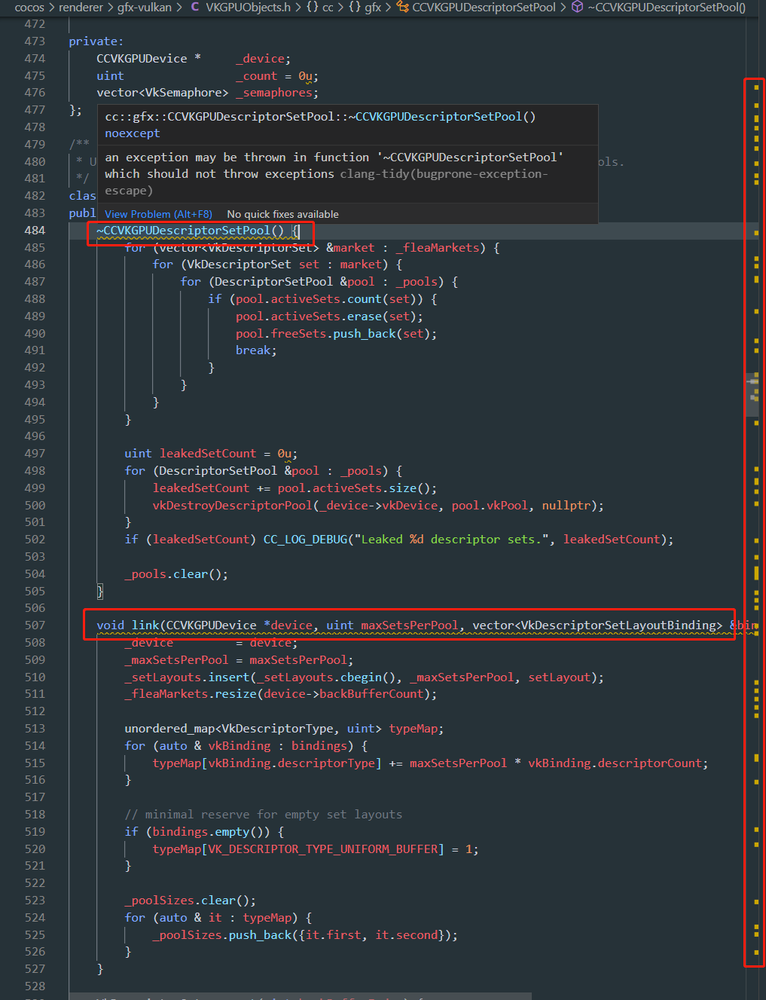
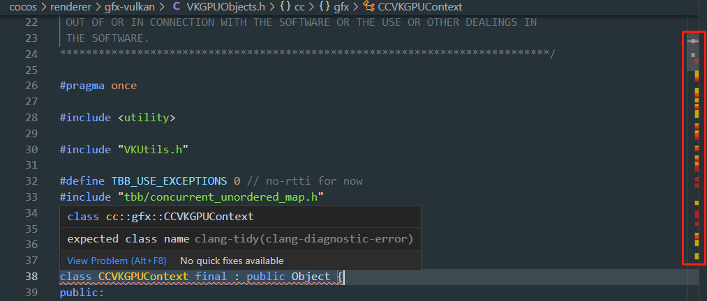
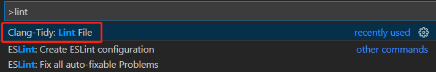
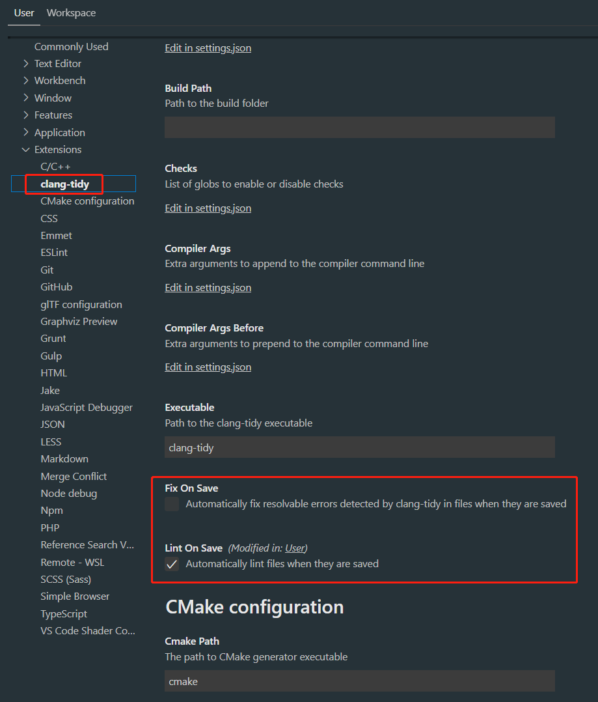
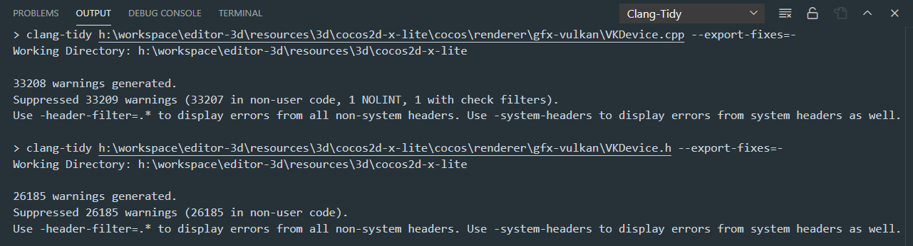
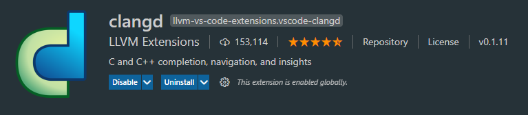
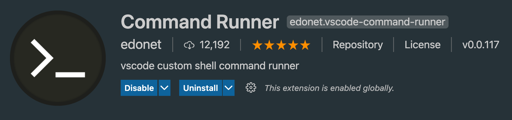

# Linter Auto-fix Guide

This is a guide to help you setting up the appropriate environment to enable auto-fixing most of the coding style check rules, including both `clang-format` and `clang-tidy`.

For now, **Visual Studio Code** is our first recommended IDE for the job, while a brief discussion about the support in different IDEs can be found at the end of this document.

## VS Code With `C/C++` & `Clang-Tidy` Extension

* Make sure both `clang-tidy` and `clang-format` are directly accessible in your terminal environment, i.e. install LLVM and add the bin folder into the environment path. LLVM 11+ is recommended.

    

* Make sure you have `ANDROID_NDK_HOME` or `ANDROID_NDK_ROOT` or `NDK_ROOT` environment variable pointing to the Android NDK path.

    

* Open terminal (or git-bash/MSYS2 if you are on windows), navigate to `engine-native` folder and run:

    ```bash
    utils/generate_compile_commands_android.sh # other platforms
    utils/generate_compile_commands_android_windows.sh # if using git-bash on windows
    ```

    If it succeeds, you should see a `compile_commands.json` generated in the same folder, and ignored by git.

    

* Install both `C/C++` and `Clang-Tidy` extension from the market:

    

* If everything goes smoothly, after opening any source file, you should be able to see the `Clang-Tidy` extension's linting process and its output as warnings right inside the editor, without any errors.

    

* But in the case when you do see errors popping up like this: (note the red color in the scroll bar)

    

    That means you have compile errors **for this single file**. Since it does compile on our target platforms as part of the engine project library, the most common cause for this issue is that the dependent header declaration is not complete, i.e. the file is not self-contained. You should always declare all the headers your file depends on.

    In the case of this screenshot, the declaration of the base class `Object` is missing, so we are indeed missing headers.

* If you've made any changes and need to re-lint the file, you should save the file and execute the `Clang-Tidy: Lint File` command:

    

    This process can be a bit repetitive if you are modifying lots of files together, so there are options to `Lint On Save` or even `Fix On Save`:

    

* After clearing the compile errors, you are ready to execute auto fix. For now the only way to do this is to just enable the `Fix On Save` option, and save the file.

    

    Note that auto-fix can not fix all the issues `Clang-Tidy` reports. You still have to manually fix some of the trickier issues, but generally most of the issues are trivial and can be auto-fixed.

    Also note that the linting and fixing process for `Clang-Tidy` is understandably time-consuming. So you should only enable the xx-on-save options when actually needed to. The screenshot does not reflect the actual time needed for the process.

* Whenever in doubt, you can always refer to the `Clang-Tidy` extension output window for more detailed information.

    

    This is a screenshot of linting issue-free files.

* For `Clang-Format` issues, there will be no in-place editor suggestions, but all issues are strictly auto-fixable, and if the environment set up above goes smoothly, it is as simple as executing the `Format Document` command. (By default `Shift + Alt + F` on Windows)

    

    This functionality is provided by the C/C++ extension.

    

    On the contrary to `Clang-Tidy`, `Clang-Format` auto-formatting is an immediate operation and should be used frequently.

> Note: The `compile_commands.json` generated by the current approach is essentially the Android development environment. So other platform-specific code may likely not be included in the check. This behavior is consistent with the CI test environment.

> Also note: Once new source files have been added to the project in the CMakeLists, the `compile_commands.json` has to be regenerated by running the same script in the third step.

## VS Code With `clangd` Extension

Another fairly decent choice is to install the `clangd` extension only: (`clangd` and `C/C++` extension conflicts with each other so you can't have both)



`clangd` is the official language server by LLVM. Compared to the first approach, it has real-time linting & fixing support (much better performance and IDE integration). However it only supports a subset of clang-tidy rules, so the reports won't be identical to the CI environment and it doesn't provide a 'fix-all' command. But combined with the CLI approach below it still can be of a great help.

## Command Line Interface

The second recommended way is to directly use the CLI.

We provide a bash script to apply auto-fix on all the changed files in arbitrary commit/range:

First make sure the first three steps in VS Code environment setup are done, i.e. `compile_commands.json` has been generated, then:

```bash
utils/tidy-fix-commit.sh # run auto-fix on files in the latest commit
utils/tidy-fix-commit.sh 70181ed # run auto-fix on files in the specified commit
utils/tidy-fix-commit.sh HEAD~3..HEAD # run auto-fix on files in the last 3 commit
```

All the issues will be reported in the standard output. This can be used as local self-test runs for CI checks.

Also, you can install the `Command Runner` extension in VSCode:



And assign a suitable key binding for fixing the current file (See the extension doc on how to do this):
```bash
clang-tidy -fix '${file}'
```

## Other IDEs

It is possible to use other IDEs as long as they [support Clang-Tidy](https://clang.llvm.org/extra/clang-tidy/Integrations.html).

Notably there is `CLion`, or the `Resharper C++` MSVC extension that can do a fairly decent job on analyzing and fixing linter issues. But both are commercially licensed and [intentionally](https://resharper-support.jetbrains.com/hc/en-us/articles/207242695-Can-I-fix-all-issues-Quick-Fixes-naming-suggestions-etc-at-once-) lacks the functionality to apply fixes to all the issues. They can either apply auto-fix per instance or apply to the whole project by issue types.

Considering the current circumstances this is usually not what we want in daily development, since the more files we touch, the heavier the burden is to pass the CI check, which detects problems on all the changed files in a single pull request.
