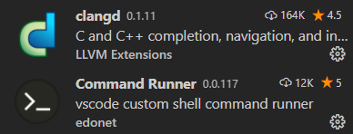
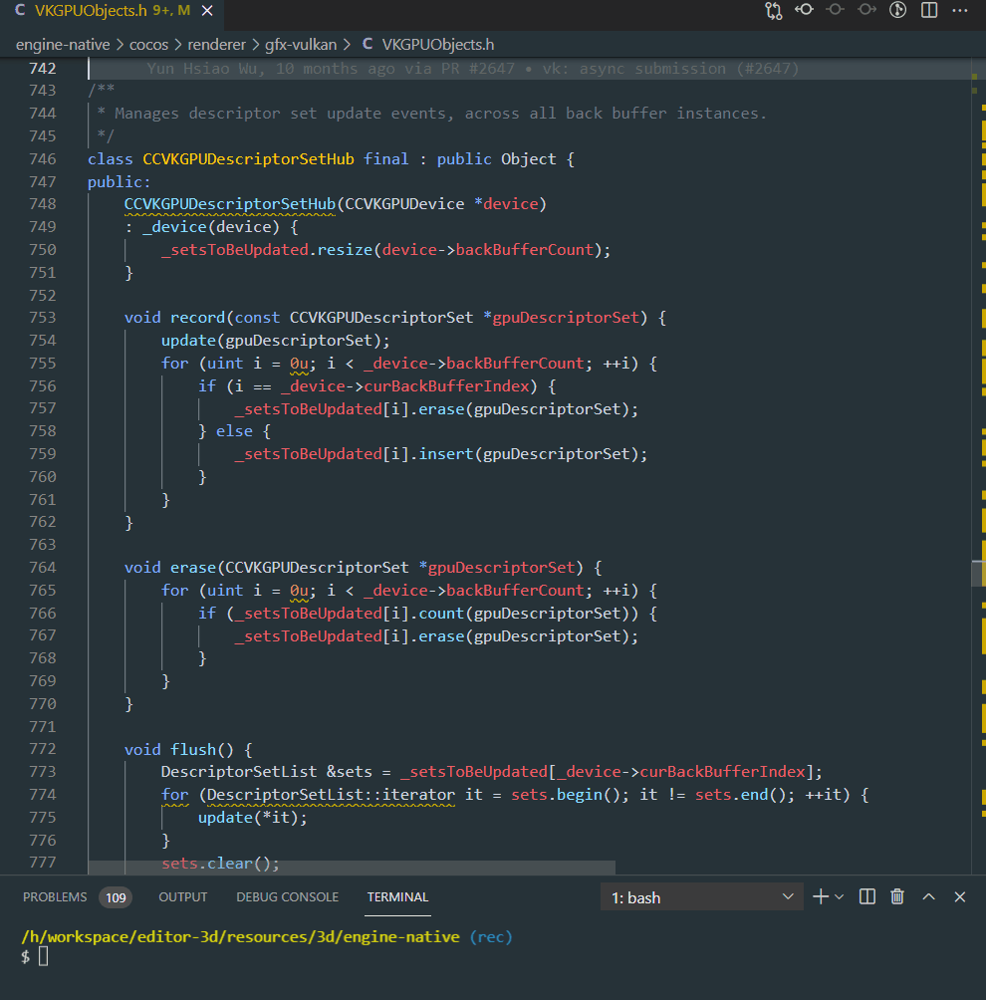

# Linter Auto-fix Guide

This is a guide to help you setting up the appropriate environment to enable auto-fixing most of the coding style check rules, including both `clang-format` and `clang-tidy`.

For now, **Visual Studio Code** is our first recommended IDE for the job, while a brief discussion about the support in different IDEs can be found at the end of this document.

## Environment Setup

* Make sure both `clang-tidy` and `clang-format` are directly accessible in your terminal environment, i.e. install LLVM and add the bin folder into the environment path. LLVM 11+ is recommended.

    

* Make sure you have `ANDROID_NDK_HOME` or `ANDROID_NDK_ROOT` or `NDK_ROOT` environment variable pointing to the Android NDK path.

    

* Open terminal (or git-bash/MSYS2 if you are on windows), navigate to `engine-native` folder and run:

    ```bash
    utils/generate_compile_commands_android.sh # other platforms
    utils/generate_compile_commands_android_windows.sh # if using git-bash on windows
    ```

    If it succeeds, you should see a `compile_commands.json` generated in the same folder, and ignored by git.

    

> Note: The `compile_commands.json` generated by the current approach is essentially the Android development environment. So other platform-specific code may likely not be included in the check. This behavior is consistent with the CI test environment.

> Also note: After changes been made to CMake configurations, the `compile_commands.json` should be regenerated by running the same script in the last step.

## VS Code With `clangd` and `Command Runner` Extension

* Install both `clangd` and `Command Runner` extension from the market:

    

* If everything goes smoothly, after opening any source file, you should be able to see the `clang-tidy` extension's linting process and its output as warnings right inside the editor, without any errors.

    

* But in the case when you do see errors popping up like this: (note the red color in the scroll bar)

    

    That means you have compile errors **for this single file**. Since it does compile on our target platforms as part of the engine project library, the most common cause for this issue is that it is not self-contained, i.e. the file does not include what it uses. You should always include all the headers your file depends on.

    In the case of this screenshot, the declaration of the base class `Object` is missing, so we are indeed missing headers.

* After clearing the compile errors, you can fix most the issue by just clicking the light bulb on the side and choose an appropriate action.

    

There are two important notes here:
* The issues reported here all come from `clangd` the language server, which only supports a subset of `clang-tidy` rules.
* It appears to be no 'fix-all' option in the editor.

This is where the `Command Runner` extension comes in and saves the day: we can assign a suitable key binding to run any CLI commands, e.g. invoke the `clang-tidy` proper and fix all the issues in the current file!

* Open the VSCode settings (JSON) and add the following property:

    

    ```js
    "command-runner.commands": {
        "tidy": "clang-tidy -fix '${file}'"
    }
    ```

* Open the keyboard shortcut preference (JSON) and add the following property:

    

    ```js
    {
        "key": "shift+alt+c", // set this to any key binding that works best for you
        "command": "command-runner.run",
        "args": { "command": "tidy" }
    }
    ```

    > Note: for more detailed instructions on setting keybindings, etc. refer to the `Command Runner` extension page.

* If everything goes smoothly, you can finally auto-fix all the issues in the current opened file with a single key binding:

    

    Note that after auto-fix some issue could morph into new ones. (e.g. at line 774 in the screenshot above, the iterator type was auto-fixed into a simple `auto`, which in turn triggered another linter issue) Just remain calm and execute the fix again and most of them will be fixed correctly.

    Also note that by invoking `clang-tidy`, this is an unavoidably time-consuming process.

* For `clang-format` issues, there are no in-place editor suggestions, but all issues are strictly auto-fixable, and if the environment set up above goes smoothly, it is as simple as executing the `Format Document` command. (By default `Shift + Alt + F` on Windows)

    

    This functionality is provided by the `clangd` extension too.

    

    On the contrary to `clang-tidy`, `clang-format` auto-formatting is an immediate operation and should be used frequently.

## More Command Line Utilities

On top of all the above infrastructures, we provide a bash script to apply auto-fix (both clang-tidy and clang-format issues) on all the changed files in arbitrary commit/range:

First make sure the environment setup steps are done, i.e. `compile_commands.json` has been generated, then:

```bash
utils/fix-tidy-format.sh # run auto-fix on files changed in the latest commit
utils/fix-tidy-format.sh 70181ed # run auto-fix on files changed in the specified commit
utils/fix-tidy-format.sh HEAD~3..HEAD # run auto-fix on files changed in the last 3 commit
```

All the issues will be reported in the standard output. This can be used as local self-test runs for CI checks.

## Usage of `NOLINT`

The general rule is: DO NOT USE IT.

That being said, however, sometimes due to various reasons (clang-tidy false positives, fixing legacy codebase just requires too much work, etc.), when there is just no way around, you can use them with specific rule tags and reasons for why it has to be this way:
```cpp
    // NOLINTNEXTLINE(google-explicit-constructor) false positive when involving __VA_ARGS__
    CC_VMATH_STRUCT(Model, transform, color, enabled)
```
Never use `NOLINT` without any explanations or rule tags.

## Other IDEs

It is possible to use other IDEs as long as they [support clang-tidy](https://clang.llvm.org/extra/clang-tidy/Integrations.html).

Notably there is `CLion`, or the `Resharper C++` MSVC extension that can do a fairly decent job on analyzing and fixing linter issues. But both are commercially licensed and [intentionally](https://resharper-support.jetbrains.com/hc/en-us/articles/207242695-Can-I-fix-all-issues-Quick-Fixes-naming-suggestions-etc-at-once-) lacks the functionality to apply fixes to all the issues. They can either apply auto-fix per issue instance or apply to the whole project by issue types.

Considering the current circumstances this is usually not what we want in daily development, since the more files we touch, the heavier the burden is to pass the CI check, which detects problems on all the changed files in a single pull request.
