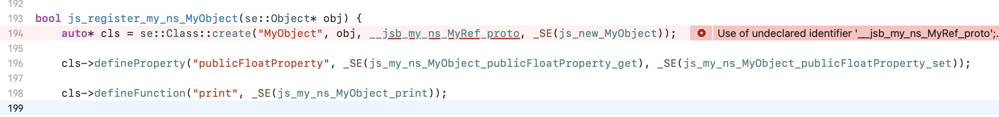
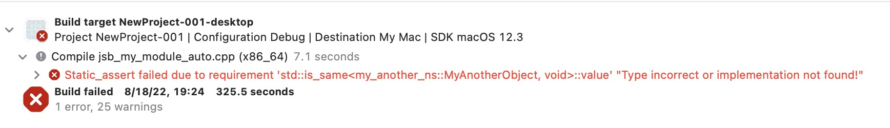

<!-- START doctoc generated TOC please keep comment here to allow auto update -->
<!-- DON'T EDIT THIS SECTION, INSTEAD RE-RUN doctoc TO UPDATE -->
**Table of Contents**

- [The Tutorial of Swig Workflow in Cocos Creator](#the-tutorial-of-swig-workflow-in-cocos-creator)
  * [How to Bind a New Module in Engine](#how-to-bind-a-new-module-in-engine)
    + [Add a new module interface file](#add-a-new-module-interface-file)
    + [Modify swig-config.js](#modify-swig-configjs)
    + [Generate bindings](#generate-bindings)
    + [Modify `engine/native/cocos/CMakeLists.txt`](#modify-enginenativecocoscmakeliststxt)
    + [Register the new module to Script Engine](#register-the-new-module-to-script-engine)
  * [How to Bind a New Module in Developer's Project](#how-to-bind-a-new-module-in-developers-project)
    + [Bind a simple class](#bind-a-simple-class)
      - [Create a simple class](#create-a-simple-class)
      - [Write an interface file](#write-an-interface-file)
      - [Write a swig config file](#write-a-swig-config-file)
      - [Generate bindings for project](#generate-bindings-for-project)
      - [Modify project's CMakeLists.txt](#modify-projects-cmakeliststxt)
      - [Open project](#open-project)
      - [Register the new module to Script Engine](#register-the-new-module-to-script-engine-1)
      - [Test binding](#test-binding)
      - [Section Conclusion](#section-conclusion)
    + [Import depended header files](#import-depended-header-files)
    + [Ignore classes, methods, properties](#ignore-classes-methods-properties)
      - [Ignore classes](#ignore-classes)
      - [Ignore methods and properties](#ignore-methods-and-properties)
    + [Rename classes, methods, properties](#rename-classes-methods-properties)
    + [Define an attribute](#define-an-attribute)
      - [Usage](#usage)
      - [Demo](#demo)
      - [%attribute_writeonly directive](#%25attribute_writeonly--directive)
      - [Reference type](#reference-type)
      - [%arg() directive](#%25arg-directive)
      - [Don't add `const`](#dont-add-const)
    + [Configure C++ modules in .i file](#configure-c-modules-in-i-file)
    + [Multiple swig modules configuration](#multiple-swig-modules-configuration)

<!-- END doctoc generated TOC please keep comment here to allow auto update -->

# The Tutorial of Swig Workflow in Cocos Creator

## How to Bind a New Module in Engine

### Add a new module interface file

- Add a new module interface file to `native/tools/swig-config` directory, e.g. `new-engine-module.i`

- Copy the content in [swig-interface-template.i](../swig-interface-template.i) to new-engine-module.i

- Add necessary configuration, you refer to the existed  `.i` files in `native/tools/swig-config` directory or refer to [the following section](#How to Bind a New Module in Developer's Project)
  

### Modify swig-config.js

```js
// ......
// Engine Module Configuration
const configList = [
    [ '2d.i', 'jsb_2d_auto.cpp' ],
    // ......
    [ 'renderer.i', 'jsb_render_auto.cpp' ],
    [ 'new-engine-module.i', 'jsb_new_engine_module_auto.cpp' ], // Add this line
];
//......
```

### Generate bindings

```bash
cd engine/native/tools/swig-config
node genbindings.js
```

### Modify `engine/native/cocos/CMakeLists.txt`

```cmake
######## auto
cocos_source_files(
    NO_WERROR   NO_UBUILD   cocos/bindings/auto/jsb_new_engine_module_auto.cpp # Add this line
                            cocos/bindings/auto/jsb_new_engine_module_auto.h # Add this line
    NO_WERROR   NO_UBUILD   cocos/bindings/auto/jsb_cocos_auto.cpp
                            cocos/bindings/auto/jsb_cocos_auto.h
    ......
```

### Register the new module to Script Engine

Open `jsb_module_register.cpp` and do the following modifications

```c++
......
#if CC_USE_PHYSICS_PHYSX
    #include "cocos/bindings/auto/jsb_physics_auto.h"
#endif
#include "cocos/bindings/auto/jsb_new_engine_module_auto.h" // Add this line

bool jsb_register_all_modules() {
    se::ScriptEngine *se = se::ScriptEngine::getInstance();
    ......
    se->addRegisterCallback(register_all_my_new_engine_module); // Add this line

    se->addAfterCleanupHook([]() {
        cc::DeferredReleasePool::clear();
        JSBClassType::cleanup();
    });
    return true;   
}
```

## How to Bind a New Module in Developer's Project

Suppose we have a Cocos Creator project located at `/Users/james/NewProject` directory.

Build a native project in Cocos Creator's build panel, we get `/Users/james/NewProject/native` directory.

### Bind a simple class

#### Create a simple class

Create a header file in `/Users/james/NewProject/native/engine/Classes/MyObject.h` , its content is 

```c++
// MyObject.h
#pragma once
#include "cocos/cocos.h"
namespace my_ns {
class MyObject {
public:
    MyObject() = default;
    MyObject(int a, bool b) {}
    virtual ~MyObject() = default;
    void print() {
        CC_LOG_DEBUG("==> a: %d, b: %d\n", _a, (int)_b);
    }

    float publicFloatProperty{1.23F};
private:
    int _a{100};
    bool _b{true};
};
} // namespace my_ns {
```

#### Write an interface file

Create an interface called `my-module.i` file in  `/Users/james/NewProject/tools/swig-config`

```c++
// my-module.i
%module(target_namespace="my_ns") my_module

// Insert code at the beginning of generated header file (.h)
%insert(header_file) %{
#pragma once
#include "bindings/jswrapper/SeApi.h"
#include "bindings/manual/jsb_conversions.h"

#include "MyObject.h" // Add this line
%}

// Insert code at the beginning of generated source file (.cpp)
%{
#include "bindings/auto/jsb_my_module_auto.h"
%}

%include "MyObject.h"
```

#### Write a swig config file

Create a file called swig-config.js in `/Users/james/NewProject/tools/swig-config`

```js
// swig-config.js
'use strict';
const path = require('path');
const configList = [
    [ 'my-module.i', 'jsb_my_module_auto.cpp' ],
];

const projectRoot = path.resolve(path.join(__dirname, '..', '..'));
const interfacesDir = path.join(projectRoot, 'tools', 'swig-config');
const bindingsOutDir = path.join(projectRoot, 'native', 'engine', 'common', 'bindings', 'auto');
// includeDirs means header search path for Swig parser
const includeDirs = [
    path.join(projectRoot, 'native', 'engine', 'common', 'Classes'),
];

module.exports = {
    interfacesDir,
    bindingsOutDir,
    includeDirs,
    configList
};
```

#### Generate bindings for project

```bash
$ cd /Users/james/NewProject/tools/swig-config
$ node < Engine Root >/native/tools/swig-config/genbindings.js
```

If succeed, the files ( `jsb_my_module_auto.cpp/.h` ) contain JS binding code will be generated at `/Users/james/NewProject/native/engine/bindings/auto` directory

#### Modify project's CMakeLists.txt

- Open `/Users/james/NewProject/native/engine/common/CMakeLists.txt`, add `MyObject.h` and its binding code

  ```cmake
  include(${COCOS_X_PATH}/CMakeLists.txt)
  
  list(APPEND CC_COMMON_SOURCES
      ${CMAKE_CURRENT_LIST_DIR}/Classes/Game.h
      ${CMAKE_CURRENT_LIST_DIR}/Classes/Game.cpp
      ############### Add the following lines ##############
      ${CMAKE_CURRENT_LIST_DIR}/Classes/MyObject.h 
      ${CMAKE_CURRENT_LIST_DIR}/bindings/auto/jsb_my_module_auto.h
      ${CMAKE_CURRENT_LIST_DIR}/bindings/auto/jsb_my_module_auto.cpp
      ########################################################
  )
  ```

- Modify `/Users/james/NewProject/native/engine/mac/CMakeLists.txt`

  ```cmake
  cmake_minimum_required(VERSION 3.8)
  # ......
  cc_mac_before_target(${EXECUTABLE_NAME})
  add_executable(${EXECUTABLE_NAME} ${CC_ALL_SOURCES})
  ############### Add the following lines ##############
  target_include_directories(${EXECUTABLE_NAME} PRIVATE
      ${CC_PROJECT_DIR}/../common
  )
  ########################################################
  cc_mac_after_target(${EXECUTABLE_NAME})
  ```


#### Open project 

macOS: `/Users/james/NewProject/build/mac/proj/NewProject.xcodeproj ` 

Windows: `< A specific directory >/NewProject/build/win64/proj/NewProject.sln`

#### Register the new module to Script Engine

Modify `Game.cpp` :

```c++
#include "Game.h"
#include "bindings/auto/jsb_my_module_auto.h" // Add this line
//......
int Game::init() {
  // ......
  se::ScriptEngine::getInstance()->addRegisterCallback(register_all_my_module); // Add this line
  BaseGame::init();
  return 0;
}
// ......
```

#### Test binding

- Add a `my-module.d.ts` file in the root of project directory to make TS compiler know our binding class.

  ```ts
  // my-module.d.ts
  declare namespace my_ns {
  class MyObject {
      constructor();
      constructor(a: number, b: number);
  
      publicFloatProperty : number;
      print() : void;
  }
  }
  ```

- Modify `/Users/james/NewProject/temp/tsconfig.cocos.json` file

  ```js
  {
    "$schema": "https://json.schemastore.org/tsconfig",
    "compilerOptions": {
      "target": "ES2015",
      "module": "ES2015",
      "strict": true,
      "types": [
        "./temp/declarations/cc.custom-macro",
        "./temp/declarations/jsb",
        "./temp/declarations/cc",
        "./temp/declarations/cc.env",
        "./my-module" // Add this line
      ],
      // ......
      "forceConsistentCasingInFileNames": true
    }
  }
  ```

- Open NewProject in Cocos Creator, create a cube object in scene and attach a script to cube, the script's content is

  ```ts
  import { _decorator, Component } from 'cc';
  const { ccclass } = _decorator;
  
  @ccclass('MyComponent')
  export class MyComponent extends Component {
      start() {
          const myObj = new my_ns.MyObject();
          myObj.print(); // Invoke native print method
          console.log(`==> myObj.publicFloatProperty: ${myObj.publicFloatProperty}`); // Get property defined in native
      }
  }
  ```

- Run project, if succeed, you could find the following logs in console 

  ```
  17:31:44 [DEBUG]: ==> a: 100, b: 1
  17:31:44 [DEBUG]: D/ JS: ==> myObj.publicFloatProperty: 1.2300000190734863
  ```

#### Section Conclusion

In this section, we have learned how to use `Swig` tool to bind a simple class, export its public methods and properties to JS. This section also cover the entire flow of binding native classes. Start from next section, we will focus on using more `Swig` features to satisfy more needs of JS bindings, for example:

- How to import depended header files
- How to ignore classes, methods, properties
- How to rename classes, methods, properties
- How to define attributes which bind c++ getter and setter as a JS property
- How to configure C++ modules in .i file

### Import depended header files

Suppose we let MyObject class be inherited from MyRef class. But we don't want to bind MyRef class.

```c++
// MyRef.h
#pragma once
namespace my_ns {
class MyRef  {
public:
    MyRef() = default;
    virtual ~MyRef() = default;
    void addRef() { _ref++; }
    void release() { --_ref; }
private:
    unsigned int _ref{0};
};
} // namespace my_ns {
```

```c++
// MyObject.h
#pragma once
#include "cocos/cocos.h"
#include "MyRef.h"
namespace my_ns {
// MyObject inherits from MyRef
class MyObject : public MyRef {
public:
    MyObject() = default;
    MyObject(int a, bool b) {}
    virtual ~MyObject() = default;
    void print() {
        CC_LOG_DEBUG("==> a: %d, b: %d\n", _a, (int)_b);
    }

    float publicFloatProperty{1.23F};
private:
    int _a{100};
    bool _b{true};
};
} // namespace my_ns {
```

When Swig parses MyObject.h,  it will not know what `MyRef` is,  it will output a warning in console.

```bash
.../Classes/MyObject.h:7: Warning 401: Nothing known about base class 'MyRef'. Ignored.
```

It's simple to fix this issue, we need to let Swig know that MyRef exists by using `%import` directive.

```c++
// ......
// Insert code at the beginning of generated source file (.cpp)
%{
#include "bindings/auto/jsb_my_module_auto.h"
%}

%import "MyRef.h" // Add this line to fix the warning
%include "MyObject.h"
```

Although Swig doesn't report the error now, the binding code will not be compiled, the error is:



We fix this in the next section by `%ignore` directive.

### Ignore classes, methods, properties

#### Ignore classes

In last section, we got a compile error in `js_register_my_ns_MyObject`. Since MyRef should not be bound, we could use`%ignore` directive to ignore it.

```c++
// my-module.i
// ......
%ignore my_ns::MyRef; // Add this line
%import "MyRef.h"
%include "MyObject.h"
```

Generate binding again, it compiles ok.

```c++
// jsb_my_module_auto.cpp
bool js_register_my_ns_MyObject(se::Object* obj) {
    auto* cls = se::Class::create("MyObject", obj, nullptr, _SE(js_new_MyObject)); // parentProto will be set to nullptr
    cls->defineProperty("publicFloatProperty", _SE(js_my_ns_MyObject_publicFloatProperty_get), _SE(js_my_ns_MyObject_publicFloatProperty_set)); 
    cls->defineFunction("print", _SE(js_my_ns_MyObject_print)); 
  // ......
}
```

#### Ignore methods and properties

We add a new method `methodToBeIgnored` and a new property `propertyToBeIgnored` to `MyObject` class.

```c++
// MyObject.h
#pragma once
#include "cocos/cocos.h"
#include "MyRef.h"
namespace my_ns {
// MyObject inherits from MyRef
class MyObject : public MyRef {
public:
// .....
    void methodToBeIgnored() {} // Add this line
    float propertyToBeIgnored{345.123F}; // Add this line
// ......
    float publicFloatProperty{1.23F};
private:
    int _a{100};
    bool _b{true};
};
} // namespace my_ns {

```

Re-generate bindings, we'll get `methodToBeIgnored` and `propertyToBeIgnored` bound.

```c++
// jsb_my_module_auto.cpp
bool js_register_my_ns_MyObject(se::Object* obj) {
    auto* cls = se::Class::create("MyObject", obj, nullptr, _SE(js_new_MyObject)); 
    cls->defineProperty("propertyToBeIgnored", _SE(js_my_ns_MyObject_propertyToBeIgnored_get), _SE(js_my_ns_MyObject_propertyToBeIgnored_set)); // this property should not be bound
    cls->defineProperty("publicFloatProperty", _SE(js_my_ns_MyObject_publicFloatProperty_get), _SE(js_my_ns_MyObject_publicFloatProperty_set)); 
    cls->defineFunction("print", _SE(js_my_ns_MyObject_print)); 
    cls->defineFunction("methodToBeIgnored", _SE(js_my_ns_MyObject_methodToBeIgnored)); // this method should not be bound
    // ......
}
```

Modify `my-module.i`to skip binding them.

```c++
// my-module.i
// ......

%ignore my_ns::MyRef;
%ignore my_ns::MyObject::methodToBeIgnored; // Add this line
%ignore my_ns::MyObject::propertyToBeIgnored; // Add this line

%import "MyRef.h"
%include "MyObject.h"
```

Re-generate bindings, they're ignored now.

```c++
// jsb_my_module_auto.cpp
bool js_register_my_ns_MyObject(se::Object* obj) {
    auto* cls = se::Class::create("MyObject", obj, nullptr, _SE(js_new_MyObject)); 
    cls->defineProperty("publicFloatProperty", _SE(js_my_ns_MyObject_publicFloatProperty_get), _SE(js_my_ns_MyObject_publicFloatProperty_set)); 
    cls->defineFunction("print", _SE(js_my_ns_MyObject_print)); 
// ......
}
```

### Rename classes, methods, properties

Swig has defined a directive called `%rename` to rename classes, methods or properties. To demonstrate, we modify MyObject again.

```c++
// MyObject.h
#pragma once
#include "cocos/cocos.h"
#include "MyRef.h"
namespace my_ns {
// MyObject inherits from MyRef
class MyObject : public MyRef {
public:
// ......
    void methodToBeRenamed() { // Add this method
        CC_LOG_DEBUG("==> hello MyObject::methodToBeRenamed");
    }
    int propertyToBeRenamed{1234}; // Add this property

    float publicFloatProperty{1.23F};
private:
    int _a{100};
    bool _b{true};
};
} // namespace my_ns {
```

Generate bindings, we get:

```c++
// jsb_my_module_auto.cpp
bool js_register_my_ns_MyObject(se::Object* obj) {
    auto* cls = se::Class::create("MyObject", obj, nullptr, _SE(js_new_MyObject)); 
    cls->defineProperty("propertyToBeRenamed", _SE(js_my_ns_MyObject_propertyToBeRenamed_get), _SE(js_my_ns_MyObject_propertyToBeRenamed_set)); 
    cls->defineProperty("publicFloatProperty", _SE(js_my_ns_MyObject_publicFloatProperty_get), _SE(js_my_ns_MyObject_publicFloatProperty_set)); 
    
    cls->defineFunction("print", _SE(js_my_ns_MyObject_print)); 
    cls->defineFunction("methodToBeRenamed", _SE(js_my_ns_MyObject_methodToBeRenamed)); 
```

If we want to rename `propertyToBeRenamed` to `coolProperty` and rename `methodToBeRenamed` to `coolMethod`, modify `my-module.i` as follows:

```c++
// my-module.i
// ......
%ignore my_ns::MyRef;
%ignore my_ns::MyObject::methodToBeIgnored;
%ignore my_ns::MyObject::propertyToBeIgnored;
%rename(coolProperty) my_ns::MyObject::propertyToBeRenamed; // Add this line
%rename(coolMethod) my_ns::MyObject::methodToBeRenamed; // Add this line

%import "MyRef.h"
%include "MyObject.h"
```

If we want to rename `MyObject` class to `MyCoolObject`, I guess you have already known how to do.  Yes, add this line:

```c++
%rename(MyCoolObject) my_ns::MyObject;
```

Re-generate bindings, get the correct name exported to JS.

```c++
// jsb_my_module_auto.cpp
// MyCoolObject, coolProperty, coolMethod are all what we want now.
bool js_register_my_ns_MyObject(se::Object* obj) {
    auto* cls = se::Class::create("MyCoolObject", obj, nullptr, _SE(js_new_MyCoolObject));
    cls->defineProperty("coolProperty", _SE(js_my_ns_MyCoolObject_coolProperty_get), _SE(js_my_ns_MyCoolObject_coolProperty_set)); 
    cls->defineProperty("publicFloatProperty", _SE(js_my_ns_MyCoolObject_publicFloatProperty_get), _SE(js_my_ns_MyCoolObject_publicFloatProperty_set)); 
    cls->defineFunction("print", _SE(js_my_ns_MyCoolObject_print)); 
    cls->defineFunction("coolMethod", _SE(js_my_ns_MyCoolObject_coolMethod)); 
    // ......
}
```

Test it, update `my-module.d.ts` and `MyComponent.ts`

```c++
// my-module.d.ts
declare namespace my_ns {
class MyCoolObject {
    constructor();
    constructor(a: number, b: number);

    publicFloatProperty : number;
    print() : void;
    coolProperty: number;
    coolMethod() : void;
}
}
```

```ts
// MyComponent.ts
import { _decorator, Component } from 'cc';
const { ccclass } = _decorator;

@ccclass('MyComponent')
export class MyComponent extends Component {
    start() {
        const myObj = new my_ns.MyCoolObject(); // Renamed to MyCoolObject
        myObj.print();
        console.log(`==> myObj.publicFloatProperty: ${myObj.publicFloatProperty}`);
        // Add the follow lines
        console.log(`==> old: myObj.coolProperty: ${myObj.coolProperty}`); 
        myObj.coolProperty = 666;
        console.log(`==> new: myObj.coolProperty: ${myObj.coolProperty}`);
        myObj.coolMethod();
    }
}
```

Build and run project, get log:

```
17:53:28 [DEBUG]: ==> a: 100, b: 1
17:53:28 [DEBUG]: D/ JS: ==> myObj.publicFloatProperty: 1.2300000190734863
17:53:28 [DEBUG]: D/ JS: ==> old: myObj.coolProperty: 1234
17:53:28 [DEBUG]: D/ JS: ==> new: myObj.coolProperty: 666
17:53:28 [DEBUG]: ==> hello MyObject::methodToBeRenamed
```

### Define an attribute

`%attribute` directive is used for bind C++ getter and setter functions as a JS property.

#### Usage

1. Define an attribute (JS property) without setter

   ```c++
   %attribute(your_namespace::your_class_name, cpp_member_variable_type, js_property_name, cpp_getter_function_name)
   ```

2. Define an attribute (JS property) with getter and setter

   ```c++
   %attribute(your_namespace::your_class_name, cpp_member_variable_type, js_property_name, cpp_getter_function_name, cpp_setter_function_name)
   ```

3. Define an attribute (JS property) without getter

   ```c++
   %attribute_writeonly(your_namespace::your_class_name, cpp_member_variable_type, js_property_name, cpp_setter_function_name)
   ```

#### Demo

To demonstrate, we add two new methods for MyObject class.

```c++
// MyObject.h
#pragma once
#include "cocos/cocos.h"
#include "MyRef.h"
namespace my_ns {
// MyObject inherits from MyRef
class MyObject : public MyRef {
public:
// ......
    void setType(int v) { _type = v; CC_LOG_DEBUG("==> setType: v: %d", v); } // Add this line
    int getType() const { return _type; } // Add this line

    float publicFloatProperty{1.23F};
private:
    int _a{100};
    bool _b{true};
    int _type{333};
};
} // namespace my_ns {
```

```c++
// my-module.i
// ......
%attribute(my_ns::MyObject, int, type, getType, setType); // Add this line

%import "MyRef.h"
%include "MyObject.h"
```

```c++
// jsb_my_module_auto.cpp
bool js_register_my_ns_MyObject(se::Object* obj) {
// ......
    cls->defineProperty("type", _SE(js_my_ns_MyCoolObject_type_get), _SE(js_my_ns_MyCoolObject_type_set)); 
// ......
}
```

```ts
// MyComponent.ts
import { _decorator, Component } from 'cc';
const { ccclass } = _decorator;

@ccclass('MyComponent')
export class MyComponent extends Component {
    start() {
        const myObj = new my_ns.MyCoolObject();
        myObj.print();
        console.log(`==> myObj.publicFloatProperty: ${myObj.publicFloatProperty}`);
        console.log(`==> old: myObj.coolProperty: ${myObj.coolProperty}`);
        myObj.coolProperty = 666;
        console.log(`==> new: myObj.coolProperty: ${myObj.coolProperty}`);
        myObj.coolMethod();
        console.log(`==> old: myObj.type: ${myObj.type}`);
        myObj.type = 888;
        console.log(`==> new: myObj.type: ${myObj.type}`);
    }
}
```

Build and run project

```
18:09:53 [DEBUG]: ==> a: 100, b: 1
18:09:53 [DEBUG]: D/ JS: ==> myObj.publicFloatProperty: 1.2300000190734863
18:09:53 [DEBUG]: D/ JS: ==> old: myObj.coolProperty: 1234
18:09:53 [DEBUG]: D/ JS: ==> new: myObj.coolProperty: 666
18:09:53 [DEBUG]: ==> hello MyObject::methodToBeRenamed
18:09:53 [DEBUG]: D/ JS: ==> old: myObj.type: 333
18:09:53 [DEBUG]: ==> setType: v: 888 // Cool, C++ setType is invoked
18:09:53 [DEBUG]: D/ JS: ==> new: myObj.type: 888 // Cool, C++ getType is invoked, 888 is return from C++
```

#### %attribute_writeonly  directive

`%attribute_writeonly` directive is an extension we added in swig  `Cocos` backend, it's used for the purpose that C++ class only has a `set` function and there isn't a `get` function.

In `native/tools/swig-config/cocos.i`, there are:

```c++
%attribute_writeonly(cc::ICanvasRenderingContext2D, float, width, setWidth);
%attribute_writeonly(cc::ICanvasRenderingContext2D, float, height, setHeight);
%attribute_writeonly(cc::ICanvasRenderingContext2D, float, lineWidth, setLineWidth);
%attribute_writeonly(cc::ICanvasRenderingContext2D, ccstd::string&, fillStyle, setFillStyle);
%attribute_writeonly(cc::ICanvasRenderingContext2D, ccstd::string&, font, setFont);
```

This is the similar functionality in JS:

```javascript
Object.defineProperty(MyNewClass.prototype, 'width', {
  configurable: true,
  enumerable: true,
  set(v) {
    this._width = v;
  },
	// No get() for property
});
```

#### Reference type

If C++ `get` function returns a reference data type or `set` function accesses a reference data type , don't forget to add `&` suffix in %attribute or %attribute_writeonly directives. The following `ccstd::string&` is an example.

```c++
%attribute_writeonly(cc::ICanvasRenderingContext2D, ccstd::string&, fillStyle, setFillStyle);
```

If `&` is missing, a temporary `ccstd::string` instance will be created while the binding function is invoked.

#### %arg() directive

Sometimes, the type of C++ variable is a describled by C++ template, for instance:

```c++
class MyNewClass {
  public:
		const std::map<std::string, std::string>& getConfig() const { return _config; }
  	void setConfig(const std::map<std::string, std::string> &config) { _config = config; }
  private:
  	std::map<std::string, std::string> _config;
};
```

We may write an `%attribute` in `.i` file like:

```c++
%attribute(MyNewClass, std::map<std::string, std::string>&, config, getConfig, setConfig);
```

You will get an error while invoking `node genbindings.js`.

```
Error: Macro '%attribute_custom' expects 7 arguments
```

This is because `swig` doesn't know how to deal with comma (`,`) in `std::map<std::string, std::string>&`, it will split it to two parts:

1. std::map<std::string
2. std::string>&

Therefore, this line of %attribute directive will be parsed with 6 arguments instead of 5.

To avoid making `swig` confused, we need to use `%arg` directive to tell `swig` that `std::map<std::string, std::string>&` is a whole thing.

```c++
%attribute(MyNewClass, %arg(std::map<std::string, std::string>&), config, getConfig, setConfig);
```

Re-run `node genbindings.js`, the error should have gone.

#### Don't add `const` 

In the above sample, `%arg(std::map<std::string, std::string>&)` is used as a C++ data type in %attribue directive. You may consider to add a `const` prefix before `std::map` like `%arg(const std::map<std::string, std::string>&)`. If you do that, you will make a readyonly `config` property which only binds `MyNewClass::getConfig`. That's obviously not what we expect. If we need a readonly property, just don't assign a `set` function. 

```c++
// Don't assign setConfig means the property doesn't need a setter.
%attribute(MyNewClass, %arg(std::map<std::string, std::string>&), config, getConfig); 
```

So to keep things simple, never add `const` prefix while writing a `%attribute` directive.

### Configure C++ modules in .i file

Sometimes, whether to compile a class depends on whether a macro is enabled. For example, we add a `MyFeatureObject` class in `MyObject.h`

```c++
// MyObject.h
#pragma once
#include "cocos/cocos.h"
#include "MyRef.h"

#ifndef USE_MY_FEATURE
#define USE_MY_FEATURE 1 // Enable USE_MY_FEATURE
#endif

namespace my_ns {

#if USE_MY_FEATURE
class MyFeatureObject {
public:
    void foo() {
        CC_LOG_DEBUG("==> MyFeatureObject::foo");
    }
};
#else
class MyFeatureObject;
#endif

// MyObject inherits from MyRef
class MyObject : public MyRef {
public:
//......
    MyFeatureObject* getFeatureObject() {
#if USE_MY_FEATURE // getFeatureObject only returns valid value when USE_MY_FEATURE is enabled
        if (_featureObject == nullptr) {
            _featureObject = new MyFeatureObject();
        }
#endif
        return _featureObject;
    }
private:
    int _a{100};
    bool _b{true};
    int _type{333};
    MyFeatureObject* _featureObject{nullptr}; // Add this line
};
} // namespace my_ns {
```

```c++
// my-module.i
// ......
%rename(MyCoolObject) my_ns::MyObject;

%attribute(my_ns::MyObject, int, type, getType, setType);

%module_macro(USE_MY_FEATURE) my_ns::MyFeatureObject; // Add this line to let Swig know the generated code for MyFeatureObject needs to be wrapped by USE_MY_FEATURE macro
%module_macro(USE_MY_FEATURE) my_ns::MyObject::getFeatureObject; // Add this line to let Swig know the generated code for MyObject::getFeatureObject should be wrapped by USE_MY_FEATURE macro

#define USE_MY_FEATURE 1 // Must be 1 to trick Swig that we need to generate binding code
// even this macro is disabled in C++. NOTE: this line should be after %module_macro

%import "MyRef.h"
%include "MyObject.h"
```

```c++
// my-module.d.ts
declare namespace my_ns {
class MyFeatureObject {
    foo() : void;
}

class MyCoolObject {
    constructor();
    constructor(a: number, b: number);

    publicFloatProperty : number;
    print() : void;
    coolProperty: number;
    coolMethod() : void;
    type: number;
    getFeatureObject() : MyFeatureObject;
}
}
```

```ts
// MyComponent.ts
import { _decorator, Component } from 'cc';
const { ccclass } = _decorator;

@ccclass('MyComponent')
export class MyComponent extends Component {
    start() {
        const myObj = new my_ns.MyCoolObject();
        myObj.print();
        console.log(`==> myObj.publicFloatProperty: ${myObj.publicFloatProperty}`);
        console.log(`==> old: myObj.coolProperty: ${myObj.coolProperty}`);
        myObj.coolProperty = 666;
        console.log(`==> new: myObj.coolProperty: ${myObj.coolProperty}`);
        myObj.coolMethod();
        console.log(`==> old: myObj.type: ${myObj.type}`);
        myObj.type = 888;
        console.log(`==> new: myObj.type: ${myObj.type}`);
        const featureObj = myObj.getFeatureObject();
        console.log(`==> featureObj: ${featureObj}`);
        if (featureObj) {
            featureObj.foo();
        }
    }
}
```

Generate bindings, look at the binding code

```c++
#if USE_MY_FEATURE // NOTE THAT, all binding code of MyFeatureObject is wrapped by USE_MY_FEATURE macro

se::Class* __jsb_my_ns_MyFeatureObject_class = nullptr;
se::Object* __jsb_my_ns_MyFeatureObject_proto = nullptr;
SE_DECLARE_FINALIZE_FUNC(js_delete_my_ns_MyFeatureObject) 

static bool js_my_ns_MyFeatureObject_foo(se::State& s)
{
// ......
}
// ......
bool js_register_my_ns_MyFeatureObject(se::Object* obj) {
    auto* cls = se::Class::create("MyFeatureObject", obj, nullptr, _SE(js_new_my_ns_MyFeatureObject)); 
// ......
}

#endif // USE_MY_FEATURE

// ......
static bool js_my_ns_MyCoolObject_getFeatureObject(se::State& s)
{
#if USE_MY_FEATURE // getFeatureObject function is also wrapped by USE_MY_FEATURE
// ......
    ok &= nativevalue_to_se(result, s.rval(), s.thisObject() /*ctx*/);
    SE_PRECONDITION2(ok, false, "MyCoolObject_getFeatureObject, Error processing arguments");
    SE_HOLD_RETURN_VALUE(result, s.thisObject(), s.rval()); 
#endif // USE_MY_FEATURE
    return true;
}
SE_BIND_FUNC(js_my_ns_MyCoolObject_getFeatureObject) 

// ......
bool register_all_my_module(se::Object* obj) {
    // Get the ns
    se::Value nsVal;
    if (!obj->getProperty("my_ns", &nsVal, true))
    {
        se::HandleObject jsobj(se::Object::createPlainObject());
        nsVal.setObject(jsobj);
        obj->setProperty("my_ns", nsVal);
    }
    se::Object* ns = nsVal.toObject();
    /* Register classes */
#if USE_MY_FEATURE
    js_register_my_ns_MyFeatureObject(ns); // js_register_my_ns_MyFeatureObject is wrapped by USE_MY_FEATURE
#endif // USE_MY_FEATURE
    js_register_my_ns_MyObject(ns); 
    return true;
}
```

Build and run the project, get output as following:

```
18:32:20 [DEBUG]: D/ JS: ==> featureObj: [object Object] // featureObj is valid if USE_MY_FEATURE macro is enabled
18:32:20 [DEBUG]: ==> MyFeatureObject::foo // Invoke C++ foo method 
```

When we don't need MyFeatureObject, set the macro to 0.

```c++
// MyObject.h
#pragma once
#include "cocos/cocos.h"
#include "MyRef.h"

#ifndef USE_MY_FEATURE
#define USE_MY_FEATURE 0 // Disable USE_MY_FEATURE
#endif
```

Build and run the project

```
18:54:00 [DEBUG]: D/ JS: ==> featureObj: undefined // getFeatureObject returns undefined if USE_MY_FEATURE is disabled.
```

### Multiple swig modules configuration

Let's create another header file `MyAnotherObject.h`.

```c++
// MyAnotherObject.h
#pragma once
namespace my_another_ns {
struct MyAnotherObject {
    float a{135.246};
    int b{999};
};
} // namespace my_another_ns {
```

Update MyObject.h

```c++
// MyObject.h
//......
class MyObject : public MyRef {
public:
// ......
    void helloWithAnotherObject(const my_another_ns::MyAnotherObject &obj) {
        CC_LOG_DEBUG("==> helloWithAnotherObject, a: %f, b: %d", obj.a, obj.b);
    }
// ......
};
} // namespace my_ns {
```

Create `/Users/james/NewProject/tools/swig-config/another-module.i`

```c++
// another-module.i
%module(target_namespace="another_ns") another_module

// Insert code at the beginning of generated header file (.h)
%insert(header_file) %{
#pragma once
#include "bindings/jswrapper/SeApi.h"
#include "bindings/manual/jsb_conversions.h"

#include "MyAnotherObject.h" // Add this line
%}

// Insert code at the beginning of generated source file (.cpp)
%{
#include "bindings/auto/jsb_another_module_auto.h"
%}

%include "MyAnotherObject.h"
```

Modify `/Users/james/NewProject/tools/swig-config/swig-config.js`

```c++
'use strict';

const path = require('path');

const configList = [
    [ 'my-module.i', 'jsb_my_module_auto.cpp' ],
    [ 'another-module.i', 'jsb_another_module_auto.cpp' ], // Add this line
];

const projectRoot = path.resolve(path.join(__dirname, '..', '..'));
const interfacesDir = path.join(projectRoot, 'tools', 'swig-config');
const bindingsOutDir = path.join(projectRoot, 'native', 'engine', 'common', 'bindings', 'auto');
const includeDirs = [
    path.join(projectRoot, 'native', 'engine', 'common', 'Classes'),
];

module.exports = {
    interfacesDir,
    bindingsOutDir,
    includeDirs,
    configList
};
```

Modify `/Users/james/NewProject/native/engine/common/CMakeLists.txt`

```cmake
# /Users/james/NewProject/native/engine/common/CMakeLists.txt
list(APPEND CC_COMMON_SOURCES
    ${CMAKE_CURRENT_LIST_DIR}/Classes/Game.h
    ${CMAKE_CURRENT_LIST_DIR}/Classes/Game.cpp
    ${CMAKE_CURRENT_LIST_DIR}/Classes/MyObject.h
    ${CMAKE_CURRENT_LIST_DIR}/Classes/MyAnotherObject.h # Add this line
    ${CMAKE_CURRENT_LIST_DIR}/bindings/auto/jsb_my_module_auto.h
    ${CMAKE_CURRENT_LIST_DIR}/bindings/auto/jsb_my_module_auto.cpp
    ${CMAKE_CURRENT_LIST_DIR}/bindings/auto/jsb_another_module_auto.h # Add this line
    ${CMAKE_CURRENT_LIST_DIR}/bindings/auto/jsb_another_module_auto.cpp # Add this line
)
```

Generate bindings again.

Update Game.cpp

```c++
#include "Game.h"
#include "bindings/auto/jsb_my_module_auto.h"
#include "bindings/auto/jsb_another_module_auto.h" // Add this line
//......

int Game::init() {
//......
    se::ScriptEngine::getInstance()->addRegisterCallback(register_all_my_module);
    se::ScriptEngine::getInstance()->addRegisterCallback(register_all_another_module); // Add this line
//
  BaseGame::init();
  return 0;
}
```

Build and compile, but get an error



Since MyObject class depends on MyAnotherObject which is defined on another module. We need to update `my-module.i` and add `#include "bindings/auto/jsb_another_module_auto.h"`.

```c++
// my-module.i
%module(target_namespace="my_ns") my_module

// Insert code at the beginning of generated header file (.h)
%insert(header_file) %{
#pragma once
#include "bindings/jswrapper/SeApi.h"
#include "bindings/manual/jsb_conversions.h"

#include "MyObject.h"
%}

// Insert code at the beginning of generated source file (.cpp)
%{
#include "bindings/auto/jsb_my_module_auto.h"
#include "bindings/auto/jsb_another_module_auto.h" // Add this line
%}

// ......
```

Compile project. It should compile ok now. 

Next, we update .d.ts

```ts
// my-module.d.ts
declare namespace my_ns {
class MyFeatureObject {
    foo() : void;
}

class MyCoolObject {
    constructor();
    constructor(a: number, b: number);

    publicFloatProperty : number;
    print() : void;
    coolProperty: number;
    coolMethod() : void;
    type: number;
    getFeatureObject() : MyFeatureObject;
    helloWithAnotherObject(obj: another_ns.MyAnotherObject) : void; // Add this line
}
}

// Add the following lines
declare namespace another_ns {
class MyAnotherObject {
    a: number;
    b: number;
}
}
```

We add some more test code of reading the properties of  `MyAnotherObject.`

```ts
// MyComponent.ts
import { _decorator, Component } from 'cc';
const { ccclass } = _decorator;

@ccclass('MyComponent')
export class MyComponent extends Component {
    start() {
        const myObj = new my_ns.MyCoolObject();
        // ......
        const anotherObj = new another_ns.MyAnotherObject(); // Add this line 
        myObj.helloWithAnotherObject(anotherObj); // Add this line
    }
}
```

Build and run project, should get output:

```
15:05:36 [DEBUG]: ==> helloWithAnotherObject, a: 135.246002, b: 999
```
